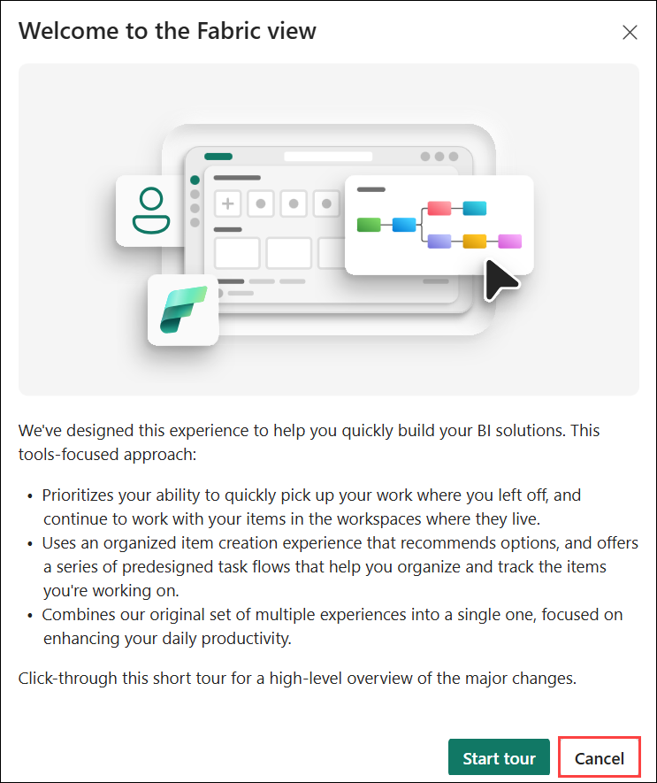
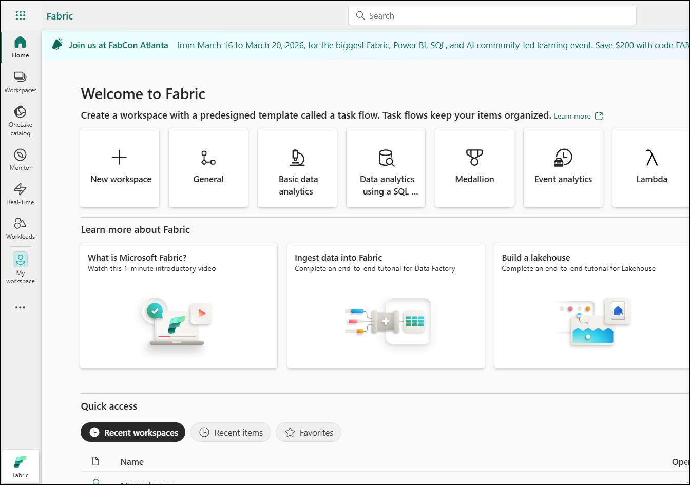

# Build data intelligent solutions with Microsoft Fabric and Azure Databricks

### Overall Estimated Duration: 4 Hours

## Overview

In this lab, you will get hands-on experience with Microsoft Fabric's end-to-end data and analytics capabilities. You will explore how to build a complete data integration and data science workflow—from ingesting raw data to transforming it, training machine learning models, and generating insights.

This lab combines Data Factory and Data Science experiences in Fabric, helping you understand how different components work together in a unified platform.

## Objectives

By completing this lab, you will:

### Data Integration (Data Factory)

- Create a pipeline to ingest data from Azure Blob Storage into a Lakehouse (Bronze layer)
- Transform raw data using Dataflows and move it to a curated (Gold) layer
- Automate workflows using triggers and notifications
- Schedule pipelines for regular execution

### Data Science (Fabric Notebooks)

- Ingest and explore data using Apache Spark
- Clean and transform data using Python
- Train machine learning models and track experiments
- Register models using MLflow
- Perform batch scoring and generate predictions
- Visualize insights using Power BI (DirectLake mode)

## Prerequisites

Before starting the lab, ensure you have:

- Access to Microsoft Fabric workspace
- Basic understanding of:
  - Data engineering concepts (ETL/ELT)
  - Python and Apache Spark
  - Machine learning fundamentals
- Familiarity with:
  - Lakehouse architecture (Bronze, Silver, Gold layers)
  - Notebooks and pipelines
- Required permissions to:
  - Create pipelines
  - Access Lakehouse
  - Use Dataflows and Notebooks

## Explanation of Components

### 1. Data Factory in Fabric

- Used for data orchestration and pipeline creation
- Helps ingest, transform, and automate data workflows
- Key features:
  - Pipelines
  - Dataflows
  - Scheduling and triggers
  - Notifications

### 2. Lakehouse Architecture

- Central storage for structured and unstructured data
- Organizes data into layers:
  - Bronze → Raw ingested data  
  - Silver → Cleaned and transformed data  
  - Gold → Business-ready curated data  

### 3. Fabric Notebooks

- Interactive environment for data science tasks
- Supports:
  - Apache Spark
  - Python (PySpark, Pandas)
- Used for:
  - Data exploration
  - Data transformation
  - Model training

### 4. MLflow Integration

- Tracks machine learning experiments
- Logs:
  - Parameters
  - Metrics
  - Models
- Enables model versioning and reproducibility

### 5. Dataflows

- Low-code/no-code data transformation tool
- Used to:
  - Clean and reshape data
  - Move data across layers (Bronze → Gold)

### 6. Power BI (DirectLake Mode)

- Used for visualization and reporting
- Directly connects to Lakehouse without data duplication
- Enables near real-time insights

## Getting Started with the Lab
 
Once the environment is provisioned, a virtual machine (LabVM) and lab guide will be loaded in your browser. Use this virtual machine throughout the workshop to perform the lab. You can see the number on the bottom of the Lab guide to switch to different exercises in the lab guide.
 
## Accessing Your Lab Environment
 
Once you're ready to dive in, your virtual machine and **Guide** will be right at your fingertips within your web browser.
 
   

### Virtual Machine & Lab Guide
 
Your virtual machine is your workhorse throughout the workshop. The lab guide is your roadmap to success.
 
## Exploring Your Lab Resources
 
To get a better understanding of your lab resources and credentials, navigate to the **Environment** tab.
 
   
 
## Utilizing the Split Window Feature
 
For convenience, you can open the lab guide in a separate window by selecting the **Split Window** button from the top right corner.
 

 
## Managing Your Virtual Machine
 
Feel free to start, stop, or restart your virtual machine as needed from the **Resources** tab. Your experience is in your hands!
 


## Lab Guide Zoom In/Zoom Out

To adjust the zoom level for the environment page, click the **A↕ : 100%** icon located next to the timer in the lab environment.

  
 
## Let's Get Started with Power BI Portal
 
1. On your virtual machine, open the **Microsoft Edge**.
 
    
 
2.  In the new tab, navigate to the **Microsoft Fabric** portal by copying and pasting the following URL into the address bar.

      ```
      https://app.fabric.microsoft.com
      ```

3. On the **Enter your email, we'll check if you need to create a new account** tab, you will see the login screen, in that enter the following email/username, and click on **Submit (2)**.

   - **Email/Username:** <inject key="AzureAdUserEmail"></inject> **(1)**
 
       
 
4. Next, provide your Temporary Access Password **(1)** and click on **Sign in (2)**:
 
   - **Temprory Access Pass:** <inject key="AzureAdUserPassword"></inject>
 
       

5. If you see the pop-up Stay Signed in?, select **No**.
   
    

6. On Microsoft Fabric (Free) license assignment dialog appears, click **OK** to proceed.

    

7. When the **Welcome to the Fabric view** dialog appears, click **Cancel**.   

    

8. You will be navigated to the **Microsoft Fabric Home page**.

    

## Support Contact

The CloudLabs support team is available 24/7, 365 days a year, via email and live chat to ensure seamless assistance at any time. We offer dedicated support channels tailored specifically for both learners and instructors, ensuring that all your needs are promptly and efficiently addressed.

Learner Support Contacts:

- Email Support: cloudlabs-support@spektrasystems.com
- Live Chat Support: https://cloudlabs.ai/labs-support

Now, click on **Next** from the lower right corner to move on to the next page.
 


## Happy Learning!!
