# Microsoft Fabric: Analytics - Day 2

### Overall Estimated Duration: 4 Hours

## Overview

In this lab, you will get hands-on experience with Microsoft Fabric’s data engineering and data integration capabilities. Participants will learn how to analyze large datasets using Apache Spark, build Delta Lake tables for structured analytics, and visualize data within notebooks. You will also design a complete data movement and transformation workflow using Data Factory pipelines and Dataflows Gen2 to ingest, clean, and enrich data before loading it into a lakehouse.

By completing this lab, learners will be equipped to process large-scale data with Spark, operationalize ETL pipelines with Data Factory, and build reliable data engineering solutions within Microsoft Fabric.

## Objective

By the end of this lab, participants will be able to:

- **Use Apache Spark notebooks** to load, explore, and transform data using PySpark and Spark SQL.

- **Create and manage Delta Lake tables** to store structured data for high-performance analytics.

- **Ingest data using Data Factory pipelines** to automate movement of files into the lakehouse.

- **Build transformations with Dataflows Gen2** to clean, merge, and enrich data using Power Query Online.

- **Orchestrate end-to-end ETL workflows** using pipelines, triggers, and notifications.

Understand the role of Spark, Delta Lake, Dataflows, Pipelines, and the Lakehouse in delivering a scalable data engineering solution.

## Pre-requisites

Participants should have:

- Basic understanding of Microsoft Fabric workspace navigation.

- Familiarity with Python, SQL, or Spark concepts.

- Understanding of ETL/ELT workflows and data engineering fundamentals.

- Basic knowledge of table structures, data formats, and transformations.

## Architecture

In this lab, you will use Microsoft Fabric to ingest, prepare, and process data using a combination of Apache Spark and Data Factory. The workflow begins with creating a lakehouse to store raw and curated data. You will load raw files into the Bronze layer and then use Spark notebooks to clean, transform, and enrich the data, generating Silver and Gold Delta tables.

You will also build a Data Factory pipeline to automate ingestion from external sources into the lakehouse. Using Dataflows Gen2, you will apply visual transformations such as filtering, merging, and creating new calculated columns. These transformed datasets are then written back to the lakehouse for downstream analytics.

Throughout the lab, you will orchestrate data movement, apply data quality rules, and operationalize workflows using scheduled pipelines, demonstrating a complete data engineering lifecycle in Fabric.

## Architecture Diagram

## Explanation of Components

The architecture for this lab involves the following key components:

1. **Lakehouse (OneLake Storage)**

    A unified storage system where both raw files and structured Delta tables reside.

    - Stores Bronze (raw), Silver (cleaned), and Gold (aggregated) layers.
    - Accessible by Spark, Dataflows, and Data Factory.

2. **Apache Spark Notebooks**

    A distributed compute engine used for large-scale data processing.

    - Load data into Spark DataFrames.
    - Apply PySpark transformations and aggregations.
    - Create and query Delta Lake tables.
    - Visualize data with Python libraries.

3. **Delta Lake**

    A storage layer that brings reliability and performance to lakehouse datasets.

    - Provides ACID transactions and schema enforcement.
    - Supports time travel, updates, merges, and streaming workloads.
    - Used for creating Silver and Gold tables.

4. **Data Factory Pipelines**

    A workflow orchestration tool for ingesting and managing data movement.

    - Copy data from external sources to the lakehouse.
    - Trigger Dataflows and downstream activities.
    - Enable automation with scheduled triggers.

5. **Dataflows Gen2 (Power Query Online)**

    A no-code data transformation service used to shape and enrich data.

    - Connects to files, tables, and HTTP sources.
    - Supports merging, filtering, column creation, and type changes.
    - Outputs curated data into lakehouse tables.

6. **Office 365 Outlook Activity**

    A pipeline activity used for notification and alerting.

    - Sends automated email updates after pipeline execution.
    - Helps simulate real operational reporting in ETL processes.

7. **Notebook Visualizations**

    Uses Python libraries such as seaborn and matplotlib within Spark notebooks.

    - Helps analysts quickly visualize trends and patterns.
    Generates bar charts, line plots, and summary views.


## Architecture Diagram

## Getting Started with the Lab
 
Once the environment is provisioned, a virtual machine (LabVM) and lab guide will be loaded in your browser. Use this virtual machine throughout the workshop to perform the lab. You can see the number on the bottom of the Lab guide to switch to different exercises in the lab guide.
 
## Accessing Your Lab Environment
 
Once you're ready to dive in, your virtual machine and **Guide** will be right at your fingertips within your web browser.
 
   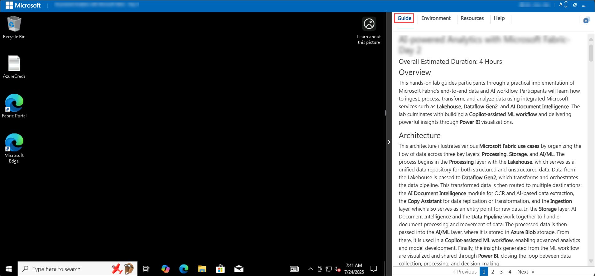

### Virtual Machine & Lab Guide
 
Your virtual machine is your workhorse throughout the workshop. The lab guide is your roadmap to success.
 
## Exploring Your Lab Resources
 
To get a better understanding of your lab resources and credentials, navigate to the **Environment** tab.
 
   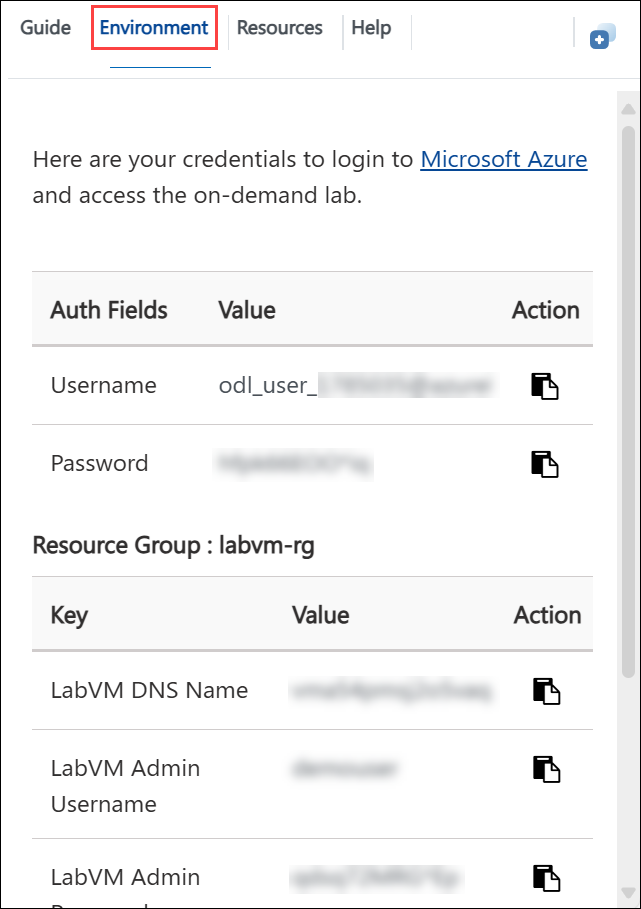
 
## Utilizing the Split Window Feature
 
For convenience, you can open the lab guide in a separate window by selecting the **Split Window** button from the top right corner.
 
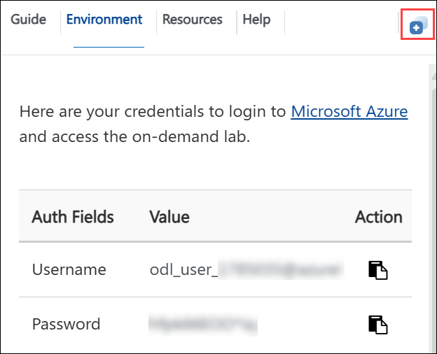
 
## Managing Your Virtual Machine
 
Feel free to start, stop, or restart your virtual machine as needed from the **Resources** tab. Your experience is in your hands!
 
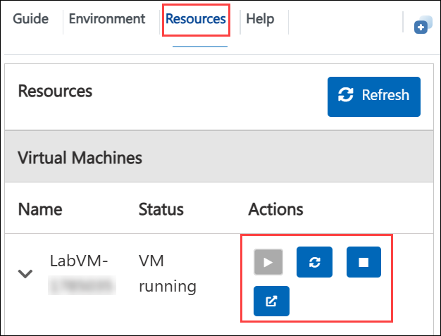

## Lab Guide Zoom In/Zoom Out

To adjust the zoom level for the environment page, click the **A↕ : 100%** icon located next to the timer in the lab environment.

  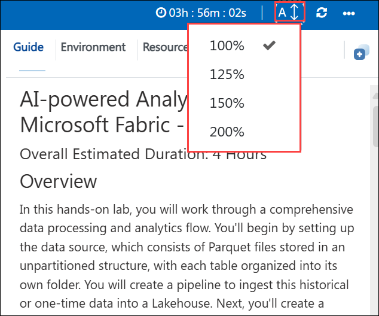
 
## Let's Get Started with Power BI Portal
 
1. On your virtual machine, open the **Microsoft Edge**.
 
    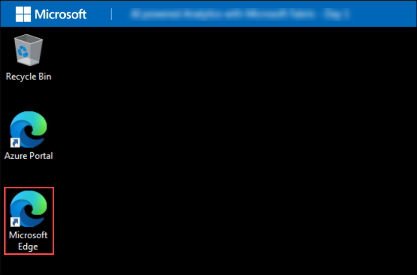
 
2.  In the new tab, navigate to the **Microsoft Fabric** portal by copying and pasting the following URL into the address bar.

      ```
      https://app.fabric.microsoft.com
      ```

3. On the **Enter your email, we'll check if you need to create a new account** tab, you will see the login screen, in that enter the following email/username, and click on **Submit (2)**.

   - **Email/Username:** <inject key="AzureAdUserEmail"></inject> **(1)**
 
       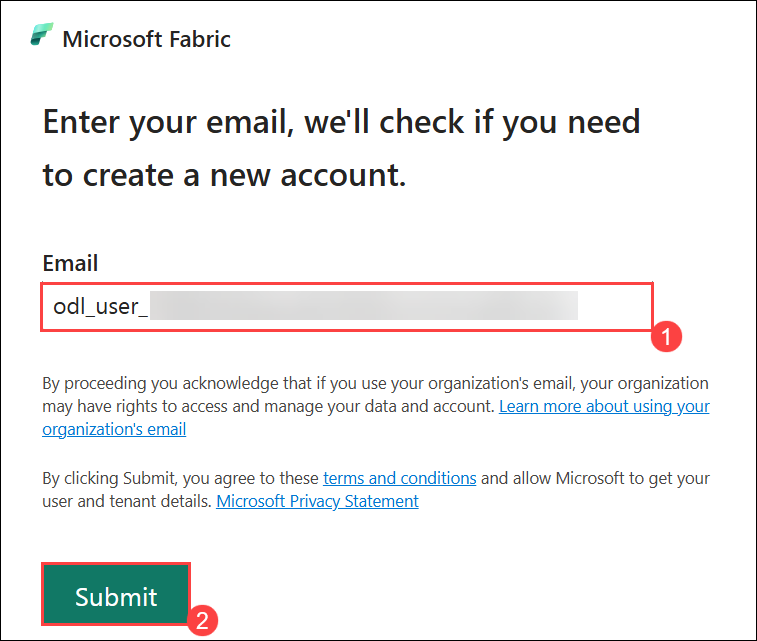
 
4. Next, provide your Temporary Access Password **(1)** and click on **Sign in (2)**:
 
   - **Temprory Access Pass:** <inject key="AzureAdUserPassword"></inject>
 
       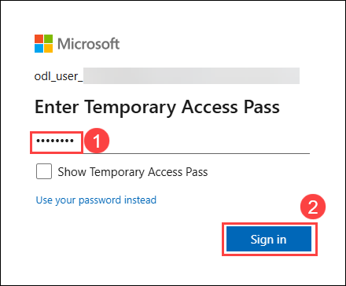

5. If you see the pop-up Stay Signed in?, select **No**.
   
    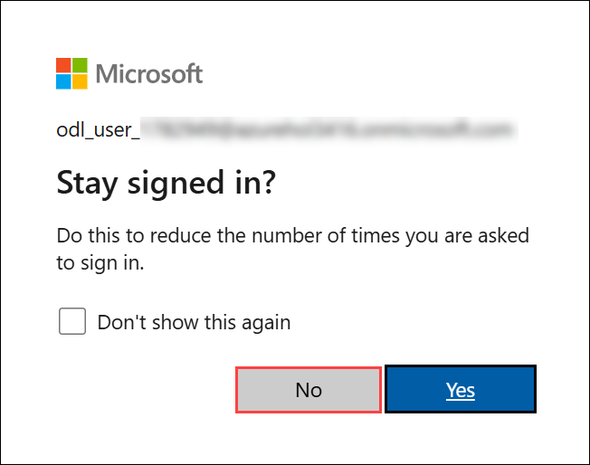

6. On Microsoft Fabric (Free) license assignment dialog appears, click **OK** to proceed.

    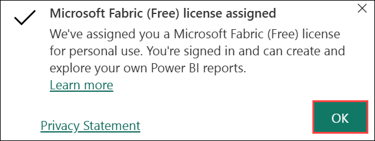

7. You will be navigated to the **Microsoft Fabric Home page**.

    


## Support Contact

The CloudLabs support team is available 24/7, 365 days a year, via email and live chat to ensure seamless assistance at any time. We offer dedicated support channels tailored specifically for both learners and instructors, ensuring that all your needs are promptly and efficiently addressed.

Learner Support Contacts:

- Email Support: cloudlabs-support@spektrasystems.com
- Live Chat Support: https://cloudlabs.ai/labs-support

Now, click on **Next** from the lower right corner to move on to the next page.
 
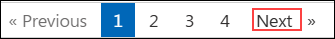

## Happy Learning!!