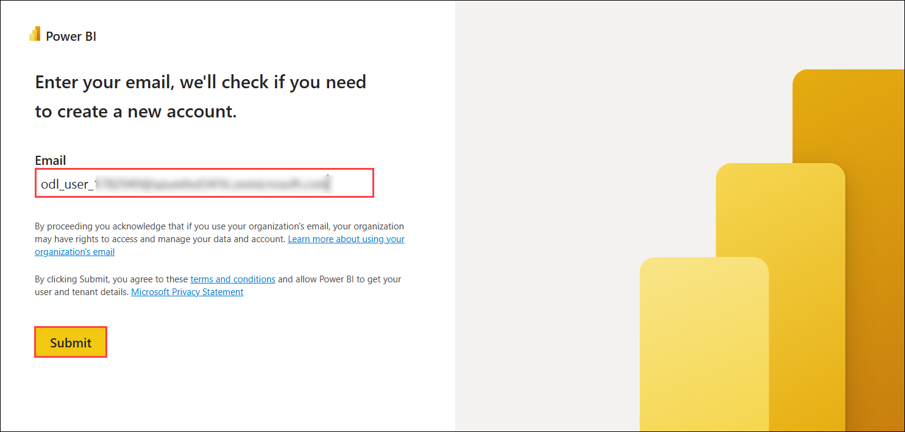
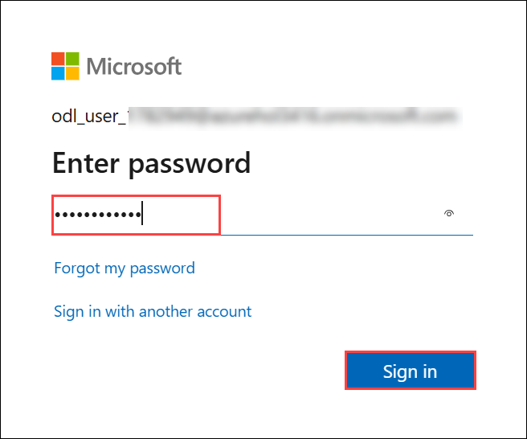
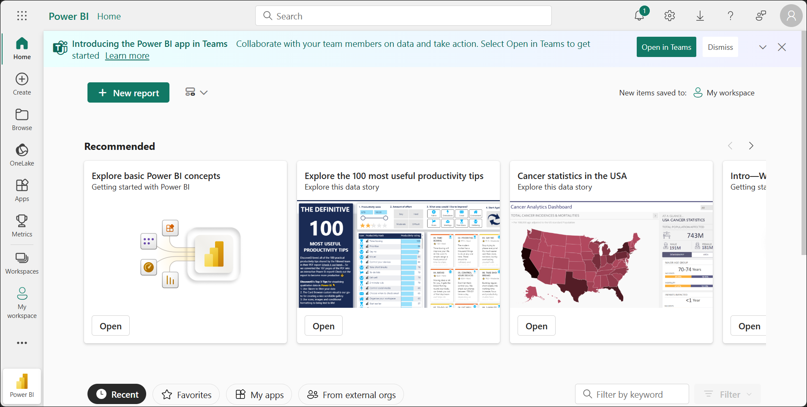

# Microsoft Fabric: Analytics - Day 3

### Overall Estimated Duration: 4 Hours

## Overview

In this lab, you will get hands-on experience with advanced data warehousing and real-time analytics capabilities in Microsoft Fabric. Participants will learn how to build a complete Sales & Geography Data Warehouse for Contoso and design a real-time stock monitoring platform for AbboCost. You will ingest batch and streaming data, transform and model it using Fabric Warehouse and KQL Database, orchestrate ETL pipelines, and build interactive Power BI reports for both historical and real-time insights.
By completing this lab, learners will be equipped to implement enterprise-grade analytics solutions that combine real-time intelligence, modern data warehousing, and business reporting within a unified Fabric environment.

## Objective

By the end of this lab, participants will be able to:

- **Create and configure a Fabric workspace and Synapse Data Warehouse** to support structured analytics.
- **Ingest data using Data Factory pipelines** from Azure Blob Storage and Eventstream sources.
- **Design and populate dimension and fact tables** in the data warehouse for sales and geographic reporting.
- **Query, transform, and aggregate data** using T-SQL, stored procedures, notebooks, and visual query builders.
- **Stream real-time data** into a KQL database and analyze trends using KQL queries.
- **Build both real-time and historical Power BI reports** using semantic models and enriched datasets.
- **Implement ETL pipelines and incremental loading** for efficient and scalable data processing.

Understand the role of each Fabric component in delivering an integrated real-time and historical analytics workflow.

## Pre-requisites

Participants should have:

- Basic understanding of SQL, data warehousing, and analytics concepts.
- Experience with Microsoft Azure portal navigation.
- Familiarity with Power BI and building simple reports.
- Awareness of real-time analytics concepts such as events, streaming, and KQL.
- Prior exposure to Microsoft Fabric workspace structure and item types (lakehouse, warehouse, pipelines).

## Architecture

In this lab, you will use Microsoft Fabric to build both batch and real-time analytics systems across two business scenarios.

The workflow for the Contoso scenario begins by deploying a Synapse Data Warehouse to store structured sales and geographical data. Raw files are ingested from Azure Blob Storage using Data Factory pipelines. You will then create and populate dimension and fact tables, perform schema cloning, implement transformation logic through stored procedures, and execute cross-warehouse queries. Finally, you will visualize insights in Power BI using semantic models and Azure Maps integration.

For the AbboCost scenario, the architecture starts with deploying a real-time stock generator application that publishes streaming events to Azure Event Hubs. Eventstream routes this data to a KQL database, enabling real-time querying, trend analysis, and Power BI streaming dashboards. A Synapse Data Warehouse is then introduced to store aggregated historical stock data. ETL pipelines are built to load data from the KQL database into warehouse tables, supporting further transformations, incremental loads, and semantic modeling.

Throughout the lab, you will combine real-time and warehouse components to simulate a modern analytics environment that supports both instantaneous insights and long-term historical reporting.

## Architecture Diagram

## Explanation of Components

The architecture for this lab involves the following key components:

1. **Fabric Workspace**

    A centralized environment where all analytical artifacts are created.

    - Hosts warehouses, notebooks, pipelines, KQL databases, Eventstreams, and reports.
    - Enables unified security, governance, and collaboration.

2. **Synapse Data Warehouse**

    A fully managed T-SQL–based data warehouse within Microsoft Fabric.

    - Stores structured sales and geographic data for Contoso.
    - Stores curated historical stock data for AbboCost.
    - Supports cloning, schemas, stored procedures, and semantic model creation.

3. **Data Factory Pipelines**

    ETL/ELT orchestration engine used to ingest, transform, and load data.

    - Loads raw data from Azure Blob Storage into the warehouse.
    - Moves curated data from KQL to Warehouse.
    - Automates transformations and incremental loads.

4. **Eventstream**

    A real-time event ingestion service in Fabric.

    - Connects to Azure Event Hubs.
    - Fan-outs streaming data to KQL databases and other destinations.
    - Provides monitoring and routing rules.

5. **KQL Database**

    A high-performance engine for real-time analytics.

    - Stores incoming streaming stock data for AbboCost.
    - Allows powerful querying using KQL for anomaly detection and trend analysis.
    - Supports real-time Power BI dashboards.

6. **Power BI**

    Visualization and reporting layer for both scenarios.

    - Real-time dashboards built using KQL data.
    - Historical reports built using warehouse semantic models.
    - Azure Maps integration for geographic insights.

7. **Azure Container Instance (Stock Generator)**

    Hosts the real-time stock generator application.

    - Continuously publishes stock price events to Event Hubs.
    - Simulates real-world streaming workloads.

8. **Azure Event Hubs**

    Streaming ingestion source for real-time data.

    - Sends events to Eventstream in Fabric.
    - Ensures high-throughput, low-latency message delivery.

9. **Notebooks**

    Interactive environment for data exploration and cross-querying.

    - Executes PySpark or SQL to analyze warehouse tables.
    - Used to validate data loads and transformations.

## Getting Started with the Lab
 
Once the environment is provisioned, a virtual machine (LabVM) and lab guide will be loaded in your browser. Use this virtual machine throughout the workshop to perform the lab. You can see the number on the bottom of the Lab guide to switch to different exercises in the lab guide.
 
## Accessing Your Lab Environment
 
Once you're ready to dive in, your virtual machine and **Guide** will be right at your fingertips within your web browser.
 
   

### Virtual Machine & Lab Guide
 
Your virtual machine is your workhorse throughout the workshop. The lab guide is your roadmap to success.
 
## Exploring Your Lab Resources
 
To get a better understanding of your lab resources and credentials, navigate to the **Environment** tab.
 
   
 
## Utilizing the Split Window Feature
 
For convenience, you can open the lab guide in a separate window by selecting the **Split Window** button from the top right corner.
 

 
## Managing Your Virtual Machine
 
Feel free to start, stop, or restart your virtual machine as needed from the **Resources** tab. Your experience is in your hands!
 


## Lab Guide Zoom In/Zoom Out

To adjust the zoom level for the environment page, click the **A↕ : 100%** icon located next to the timer in the lab environment.

  
 
## Let's Get Started with Power BI Portal
 
1. On your virtual machine, open the **Microsoft Edge**.
 
    
 
2.  In a new tab, navigate to the **Power BI** portal by copying and pasting the following URL into the address bar:

      ```
      https://app.powerbi.com/
      ```

3. On the **Enter your email, we'll check if you need to create a new account** tab, you will see the login screen, in that enter the following email/username, and click on **Submit**.

   - **Email/Username:** <inject key="AzureAdUserEmail"></inject>
 
       
 
4. Next, provide your password:
 
   - **Password:** <inject key="AzureAdUserPassword"></inject>
 
       

5. First-time users are often prompted to Stay Signed In. If you see any such pop-up, click on **No**.
   
    

6. On Microsoft Fabric (Free) license assignment dialog appears, click **OK** to proceed.

    

7. You will be navigated to the **Power BI Home page**.

    

## Support Contact

The CloudLabs support team is available 24/7, 365 days a year, via email and live chat to ensure seamless assistance at any time. We offer dedicated support channels tailored specifically for both learners and instructors, ensuring that all your needs are promptly and efficiently addressed.

Learner Support Contacts:

- Email Support: cloudlabs-support@spektrasystems.com
- Live Chat Support: https://cloudlabs.ai/labs-support

Now, click on **Next** from the lower right corner to move on to the next page.
 


## Happy Learning!!