# Use Case 01: Data Factory solution for moving and transforming data with dataflows and data pipelines

## Introduction

This use case helps you accelerate the evaluation process for Data Factory in
Microsoft Fabric by providing a step-by-step guidance for a full data
integration scenario within one hour. By the end of this tutorial, you
understand the value and key capabilities of Data Factory and know how
to complete a common end-to-end data integration scenario.

## Objective

You'll perform the following tasks in this Use Case:

- Exercise 1: Create a pipeline with Data Factory

   - Task 1: Create a workspace
   - Task 2: Create a lakehouse and Ingest sample data

- Exercise 2: Transform data with a dataflow in Data Factory

   - Task 1: Get data from a Lakehouse table
   - Task 2: Transform the data imported from the Lakehouse
   - Task 3: Connect to a CSV file containing discount data
   - Task 4: Transform the discount data
   - Task 5: Combine trips and discounts data
   - Task 6: Load the output query to a table in the Lakehouse 

- Exercise 3: Automate and send notifications with Data Factory
 
   - Task 1: Add an Office 365 Outlook activity to your pipeline
   - Task 2: Schedule pipeline execution
   - Task 3: Add a Dataflow activity to the pipeline
   - Task 4: Clean up resources

## Exercise 1: Create a pipeline with Data Factory

### Task 1: Create a workspace

Before working with data in Fabric, create a workspace with the Fabric
trial enabled.

1. On the Microsoft **Fabric Home Page**, select **New workspace**
    option.

     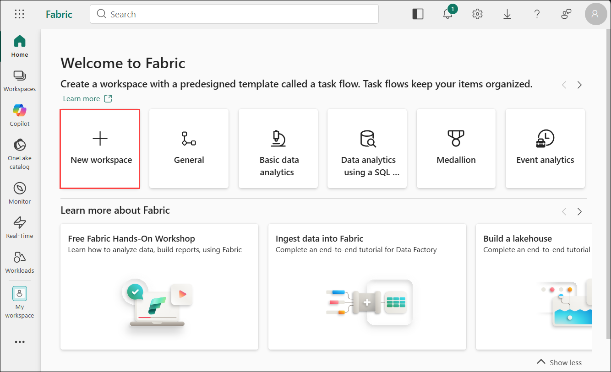

1. In the **Create a workspace tab**, enter the following details and
    click on the **Apply (4)** button.
	
    |   |   |
    |----|---|
    |Name	| Enter **Data-Factory- (1)**  |
    |Workspace type |	Select **Fabric (2)**, under Details you must see fabric capacity |
    |Semantic model storage format|	Select **Small semantic model storage format (3)** |


     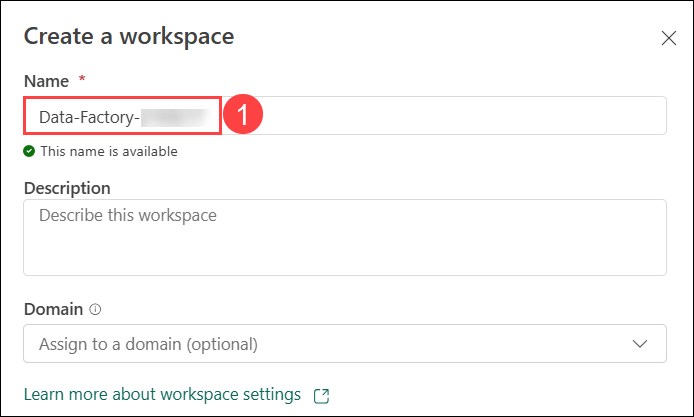

     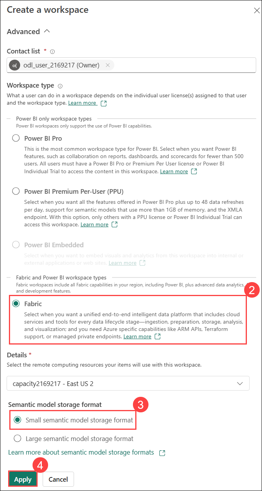

1. Wait for the deployment to complete. It’ll take approximately 2-3
    minutes.


### Task 2: Create a lakehouse and Ingest sample data

1. In the **Data-Factory-** workspace page, navigate and click on **+ New item** in the workspace to create a new resource.

     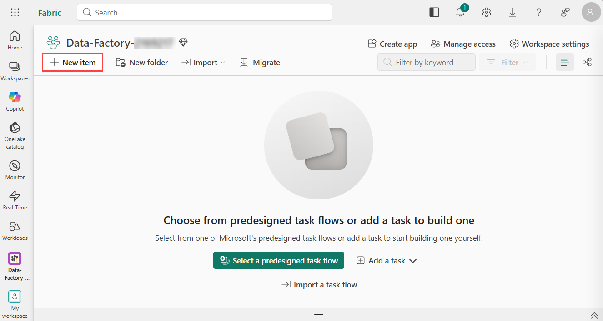

1. In the **New item** window, search for **Lakehouse (1)** in the search bar and select **Lakehouse (2)** from the results to create a new Lakehouse item.

     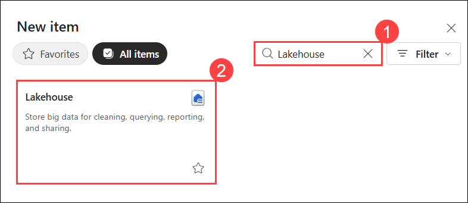

1. In the **New lakehouse** dialog box, enter **DataFactoryLakehouse (1)** in the **Name** field, ensure the **Data-Factory-** workspace is selected under **Location** and leave **Lakehouse schemas (2)** unchecked. Click **Create (3)** to proceed.

     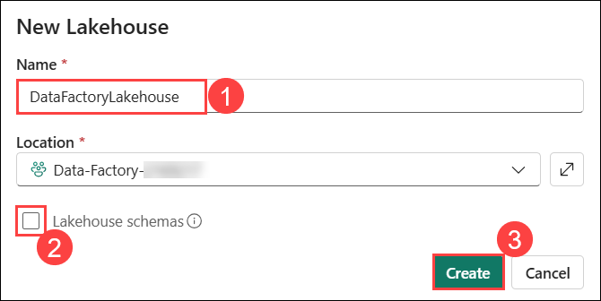

     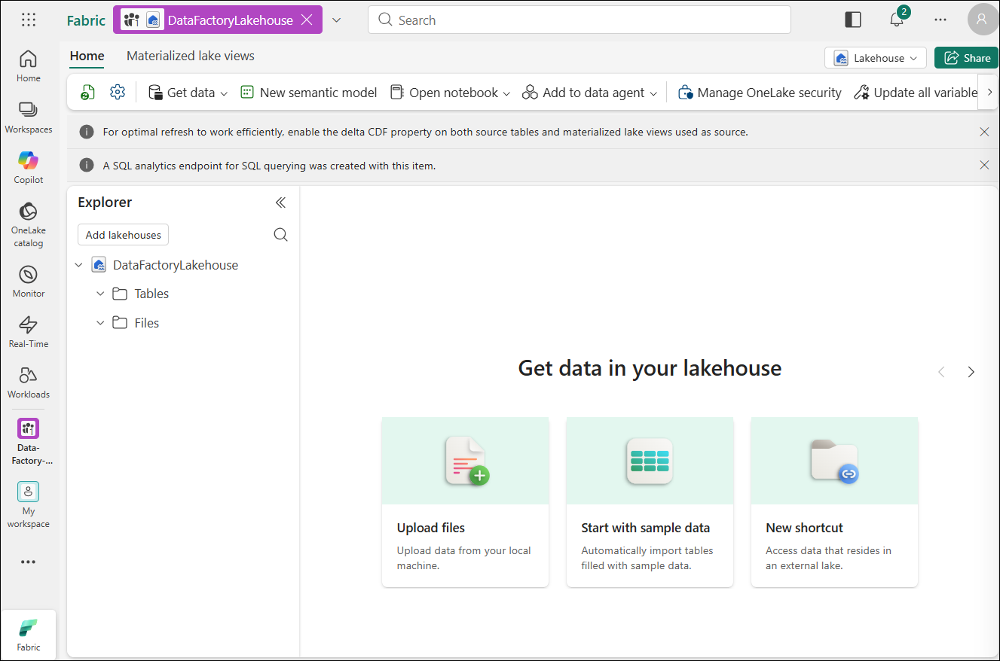

1. In the **lakehouse** home page, select **Start with sample data** to
    open the copy sample data

     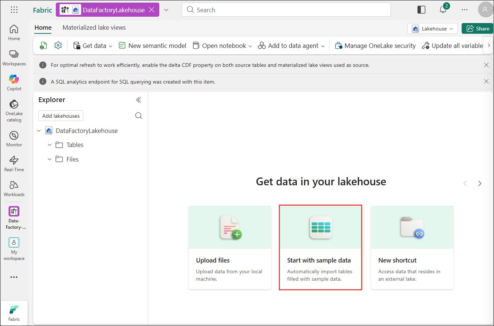

1. The **Use a sample** dialog is displayed, select the **NYCTaxi**
    sample data tile.

     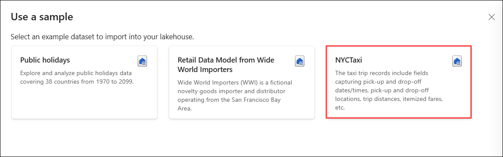

     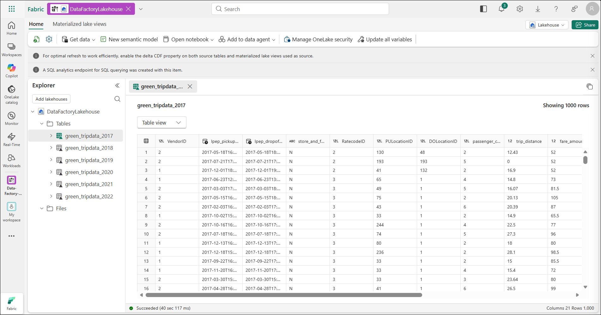
    
1. Click the **ellipsis (...)(1)** next to the the **green_tripdata_2022**  table, select **Rename (2)**.

     

1. In the **Rename** dialog box, under **Name** field,
    enter **Bronze (1)** to change the name of **table**. Then, click
    on the **Rename (2)** button.

     

     

## Exercise 2: Transform data with a dataflow in Data Factory

### Task 1: Get data from a Lakehouse table

1. Click on **Data-Factory- (1)** in the left navigation pane, then select your **Data-Factory- workspace (2)** to open it.

     

1. Click **+ New item (1)**, search for **Dataflow Gen2 (2)**, and select **Dataflow Gen2 (3)** to create a new dataflow.

     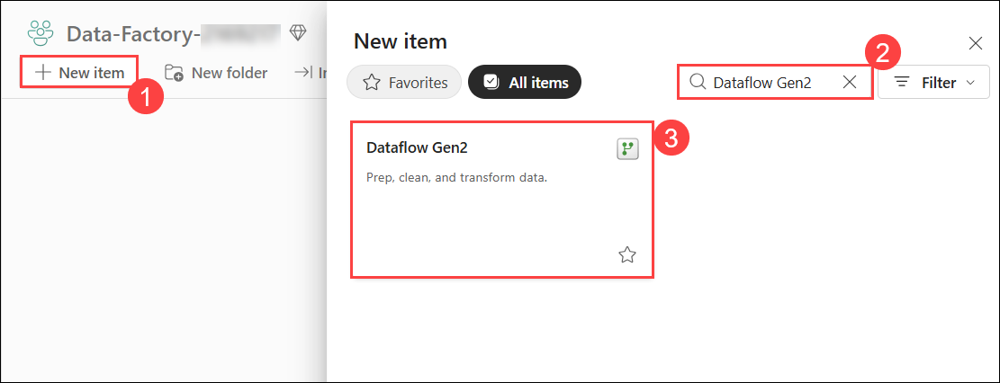

1. Provide a New Dataflow Gen2 Name as **nyc_taxi_data_with_discounts (1)** and then select **Create (2)**.

     

1. Click on **Get Data (1)** drop- down in the Home ribbon, then select **More... (2)** to explore additional data source options.

     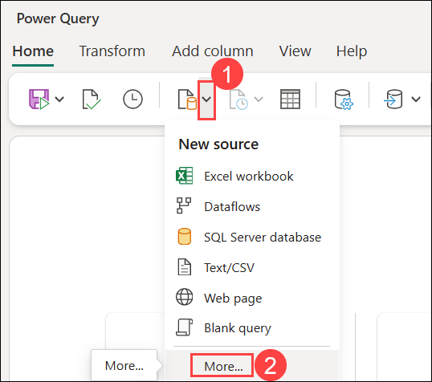

1. In the **Choose data source** tab, search box search type **Lakehouse (1)** and then click on the **Lakehouse (2)** connector.

     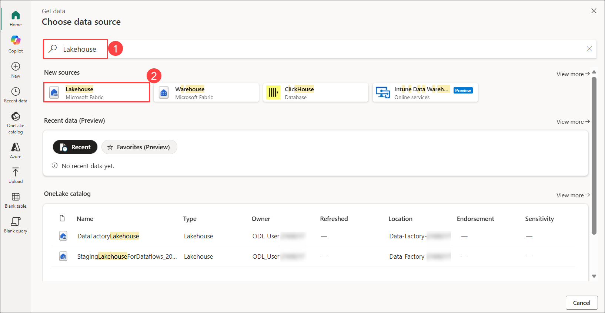

1. Select **Create new connection (1)** under Connection, then click **Next (2)** to proceed.

     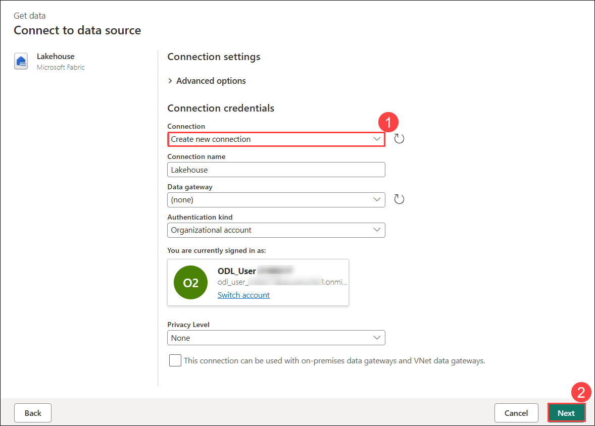

1. Expand **Lakehouse (1)** → **Data-Factory- (2)** → **DataFactoryLakehouse (3)**, select the **Bronze table (4)**, and click **Create (5)** to load the data.

     

1. You’ll see the canvas is now populated with the data.

     

### Task 2: Transform the data imported from the Lakehouse

1. Select the **data type (1)** icon in the column header of the second
    column, **IpepPickupDatetime**, to display a dropdown menu and
    select the data type from the menu to convert the column from
    the **Date/Time** to **Date (2)** type.

     

1. On the **Home** tab of the ribbon, select the **Choose
    columns** option from the **Manage columns** group.

1. On the **Home** tab, expand ribbon if needed **(1)**, then click **Choose columns (2)** and select **Choose columns (3)** to pick the required columns for your dataset.

     

1. On the **Choose columns** dialog, **deselect** some columns listed
    here, then select **OK (3)**.

    - lpepDropoffDatetime **(1)**

    - DoLocationID **(2)**

      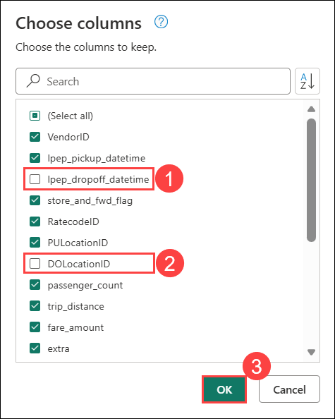

1. Click the filter dropdown on **store_and_fwd_flag (1)** if you see a warning **List may be incomplete**, select **Load more (2)** to see all the data. 

   

1. Select '**Y' (1)** to show only rows where a discount was applied, and
    then select **OK (2)**.

     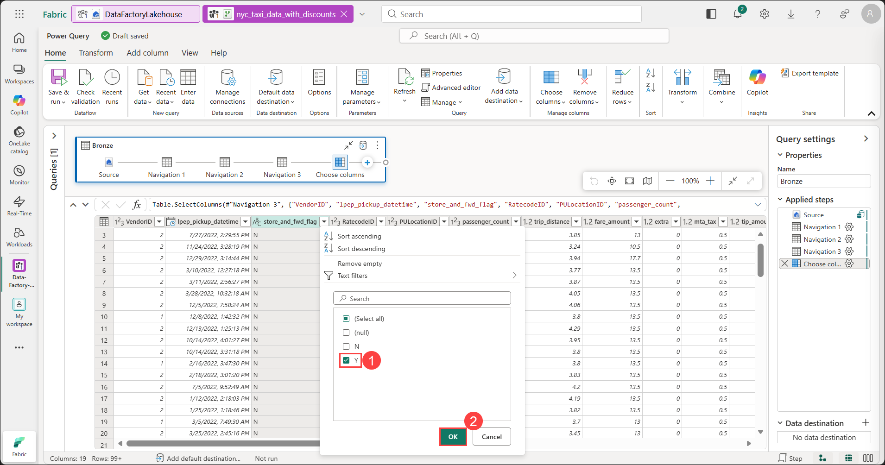

1. Click the filter dropdown on **lpep_pickup_datetime (1)**, expand **Date filters (2)**, and select **Between... (3)** to filter the data within a specific date range.

     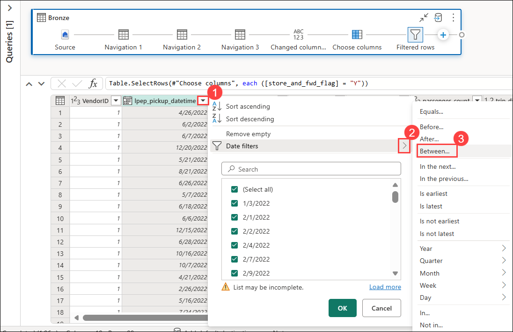

1. In the **Filter rows** window, select the date using the **calendar icon (1)**, set the start date to **1/1/2022 (2)**, choose the end date using the **calendar icon (3)**, set it to **1/31/2022 (4)**, and click **OK (5)** to apply the filter.

     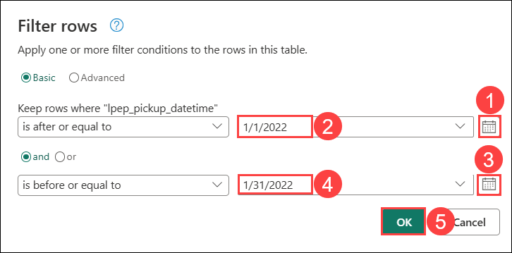

### Task 3: Connect to a CSV file containing discount data

Now, with the data from the trips in place, we want to load the data
that contains the respective discounts for each day and VendorID, and
prepare the data before combining it with the trips data.

1. From the **Home** tab in the dataflow editor menu, click **Get data (1)** from the toolbar, then select **Text/CSV (2)** to import data from a CSV file.

     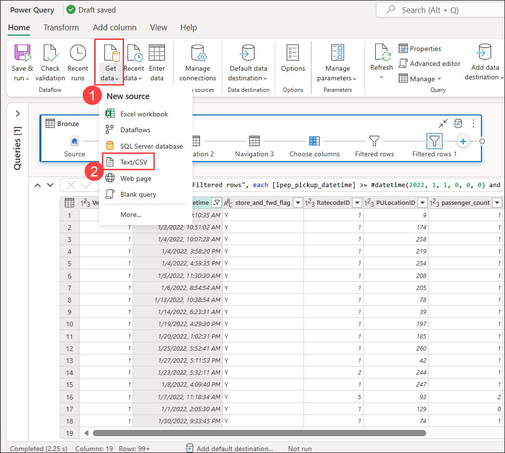

1. In the **Connect to data source** pane, select **Link to file (1)**, enter the following file URL in **File path or URL (2)**, and enter the Connection name as **dfconnection (3)** make sure **authentication kind** is set to **Anonymous (4)**. click on the **Next (5)** button.

     ```
     https://raw.githubusercontent.com/ekote/azure-architect/master/Generated-NYC-Taxi-Green-Discounts.csv
     ```

     

1. On the **Preview file data** dialog, select **Create**.

     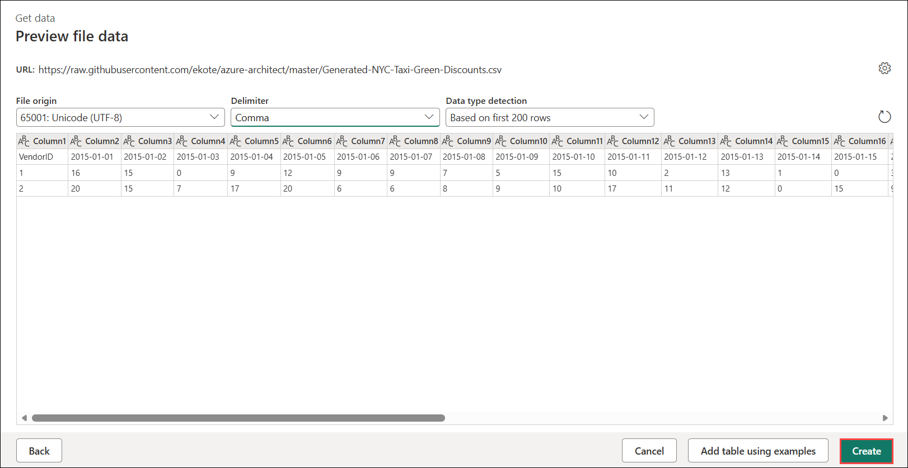

### Task 4: Transform the discount data

1. Reviewing the data, we see the headers appear to be in the first
    row. Promote them to headers by selecting the table icon **(1)** and select **Use first row as headers (2)** to set the first row as column headers.


     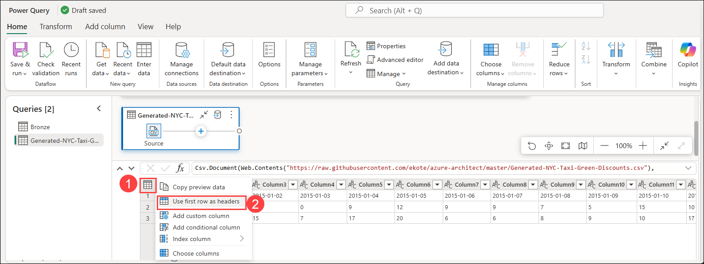
    
     > **Note:** After promoting the headers, you can see a new step added to the **Applied steps** pane at the top of the dataflow editor to the data types of your columns.

      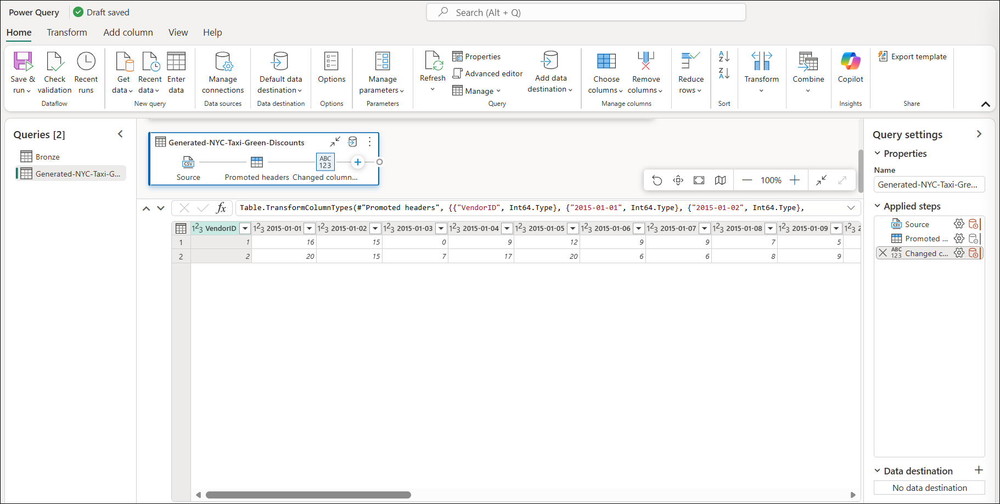

1. Right-click the **VendorID (1)** column, and from the context menu displayed, select the option **Unpivot other columns (2)**. This allows you to transform columns into attribute-value pairs, where columns become rows.

     

1. With the table unpivoted, double click on **Attribute** column title and rename the **Attribute** to **Date** column.

     

     

1. With the table unpivoted, double click on **Value** column title and rename the **Value** to **Discount** column.

     

1. Change the data type of the **Date** column by selecting the data
    type menu to the left of the column name and choosing **Date**.

     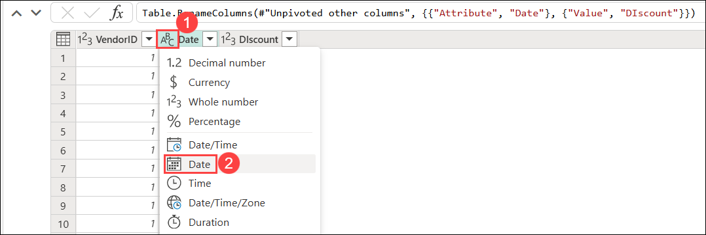

1. Select the **Discount (1)** column and then select the **Transform (2)** tab from the top ribbon. Under **Number column**, select **Standard (3)** numeric transformations from the sub-menu, and choose **Divide (4)**.

     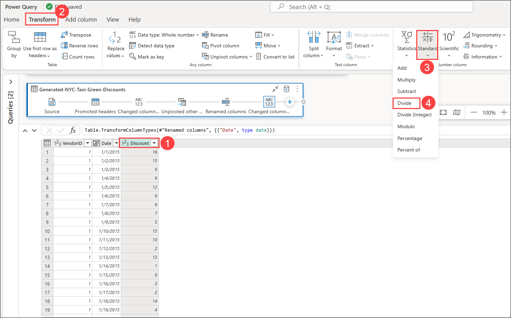

1. On the **Divide** dialog, enter the value **100 (1)**, then click on
    **OK (2)** button.

     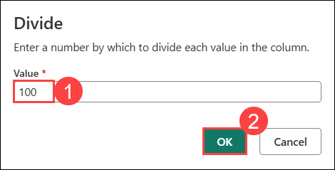

     

### Task 5: Combine trips and discounts data

The next step is to combine both tables into a single table that has the
discount that should be applied to the trip, and the adjusted total.

1. First, toggle the **Diagram view** button so you can see both of
    your queries.

     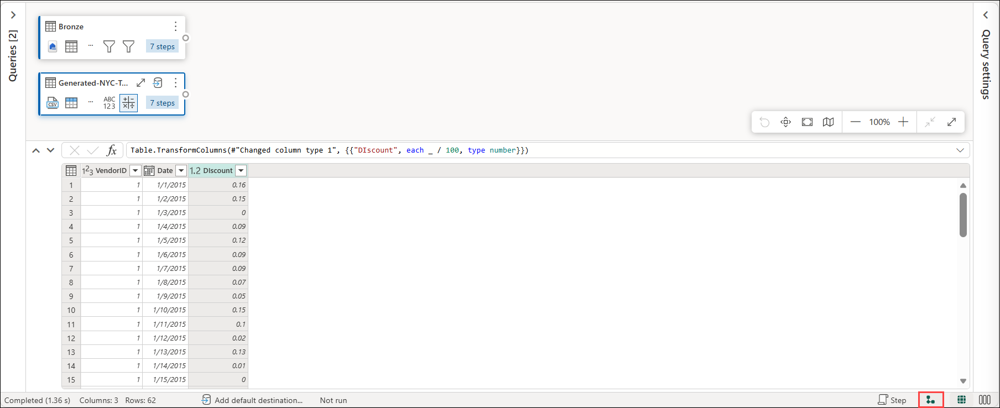

1. Select the **Bronze (1)** query, and on the **Home (2)** tab, Select the **Combine (3)** menu and choose **Merge queries (4)**, then **Merge queries as new (5)**.

     

1. On the **Merge** dialog, select **Generated-NYC-Taxi-Green-Discounts (1)** from the **Right table for merge** drop down, and then select the "**light bulb (2)**" icon on the top right of the dialog to see the suggested mapping of columns.

1. Choose choose the VendorID → VendorID mapping **(3)**, then select **OK (4).** 

     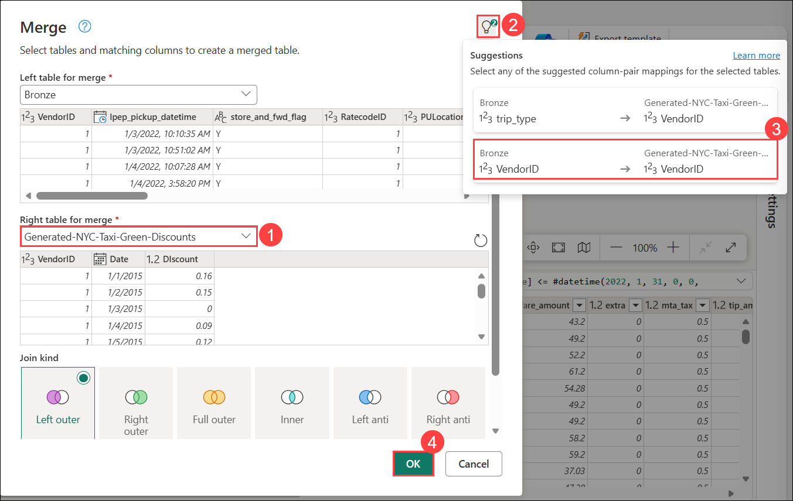

6. In the table area, you'll initially see a warning that "The
    evaluation was canceled because combining data from multiple sources
    may reveal data from one source to another. Select continue if the
    possibility of revealing data is okay." Select **Continue** to
    display the combined data.

     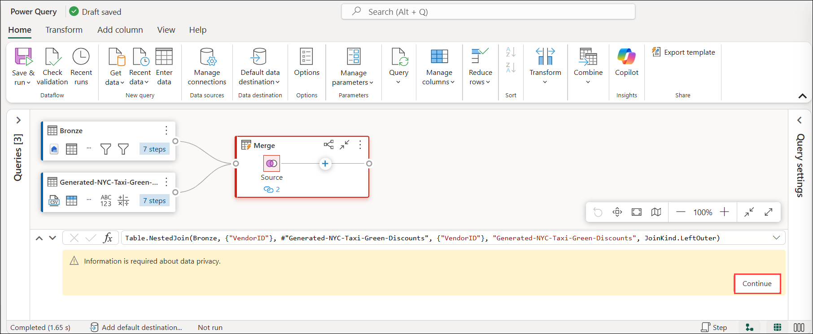

7. In Privacy Levels dialog box, select the **check box :Ignore Privacy Levels checks for this document. Ignoring privacy Levels could expose sensitive or confidential data to an unauthorized person (1)** and click on the **Save (2)** button.

     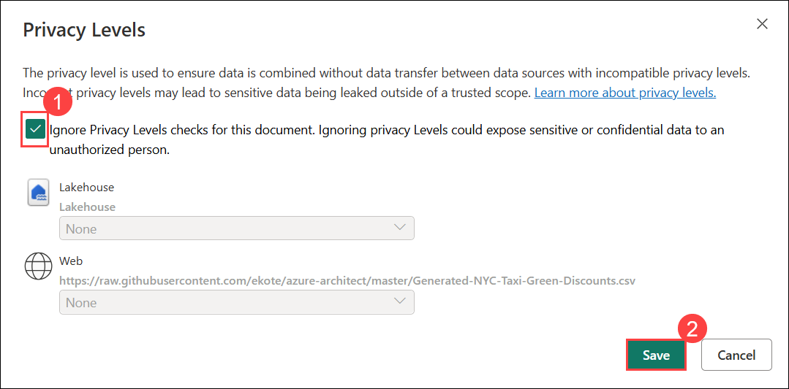

     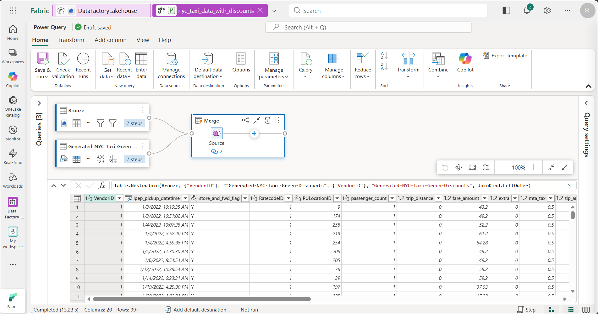

1. Notice how a new query was created in Diagram view showing the relationship of the new **Merge (1)** query with the two queries you previously created. Looking at the table pane of the editor, **scroll to the right (2)** of the Merge query column list to see a new column with table values is present. This is the "Generated NYC Taxi-Green-Discounts" column, and its type is **\[Table\]**.

1. In the column header there's an icon with two arrows going in opposite directions **(3)**, allowing you to select columns from the table. **Deselect VendorID (4)** column, and then select **OK (5)**.

     

9. With the discount value now at the row level, we can create a new
    column to calculate the total amount after discount. To do so,
    select the **Add column (1)** tab at the top of the editor, and
    choose **Custom column (2)**.

     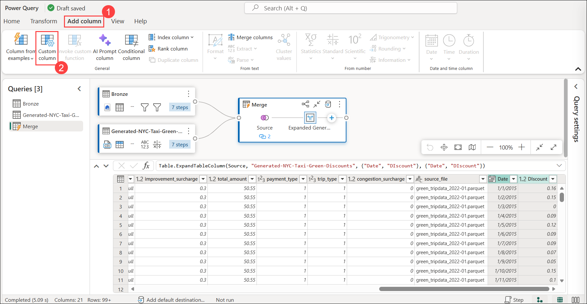

1. On the **Custom column** dialog, you can use the [Power Query formula language (also known as M)](https://learn.microsoft.com/en-us/powerquery-m) to define how your new column should be calculated.

1. Enter **TotalAfterDiscount (1)** for the **New column name** select **Currency (2)** for the **Data type**, and provide the following M expression for the **Custom column formula (3)**, then select **OK (4)**.

    ```
    if [total_amount] > 0 then [total_amount] * ( 1 -[Discount] ) else [total_amount]
    ```

     

     

1. Scroll to the right of the table **(1)**, select the newly create **TotalAfterDiscount (2)** column and then select the **Transform (3)** tab at the top of the editor window. On the **Number column** group, select the **Rounding (4)** drop down and then choose **Round... (5)**.

    > **Note**: If you can’t find the **rounding** option, expand the menu to
    see **Number column**.

       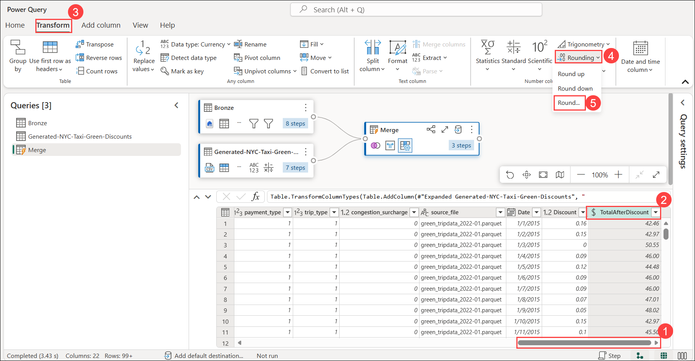

1. On the **Round** dialog, enter **2 (1)** for the number of decimal places and then select **OK (2)**.

     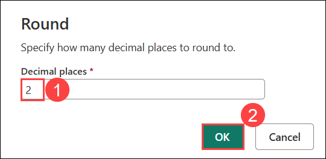

     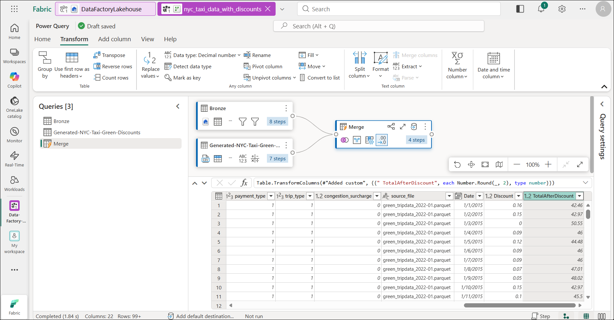

1. Click on **data type (1)** icon to change the data type of the **IpepPickupDatetime** from **Date** to **Date/Time (2)**.

     

1. Finally, expand the **Query settings (1)** pane from the right side of
    the editor if it isn't already expanded, and rename the query
    from **Merge** to **Output (2)**.

     

### Task 6: Load the output query to a table in the Lakehouse

With the output query now fully prepared and with data ready to output,
we can define the output destination for the query.

1. Select the **Output (1)** merge query created previously. Then select
    the **+ icon (2)** from the bottom- right corner to add **data destination** to this Dataflow.

1. From data destination list, select **Lakehouse (3)** option under the
    New destination.

     

1. On the **Connect to data destination** dialog, your connection
    should already be selected. Select **Next** to continue.

     

1. On the **Choose destination target** dialog, expand **Lakehouse (1)**, navigate to your workspace **Data-Factory- (2)**, choose **DataFactoryLakehouse (3)**, then click **Next (4)** to proceed.

     

1. On the **Choose destination settings** dialog, **disable Use automatic setting ()** leave the default **Replace** update method, double check that your columns are mapped correctly, and select **Save settings (2)**.

     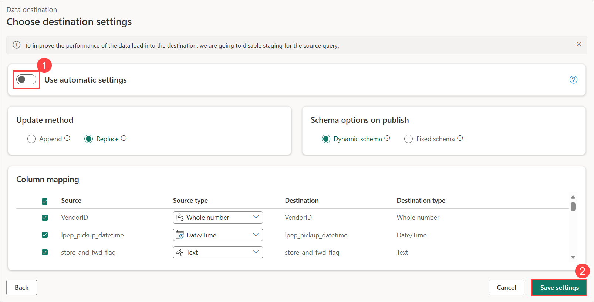

1. Back in the main editor window, confirm that you see your output destination on the **Query settings** pane for the **Output** table as **Lakehouse**. In the **Home (1)** tab, click on **Save and Run (2)** icon and then select **Save & run (3)** option from the drop-down.

     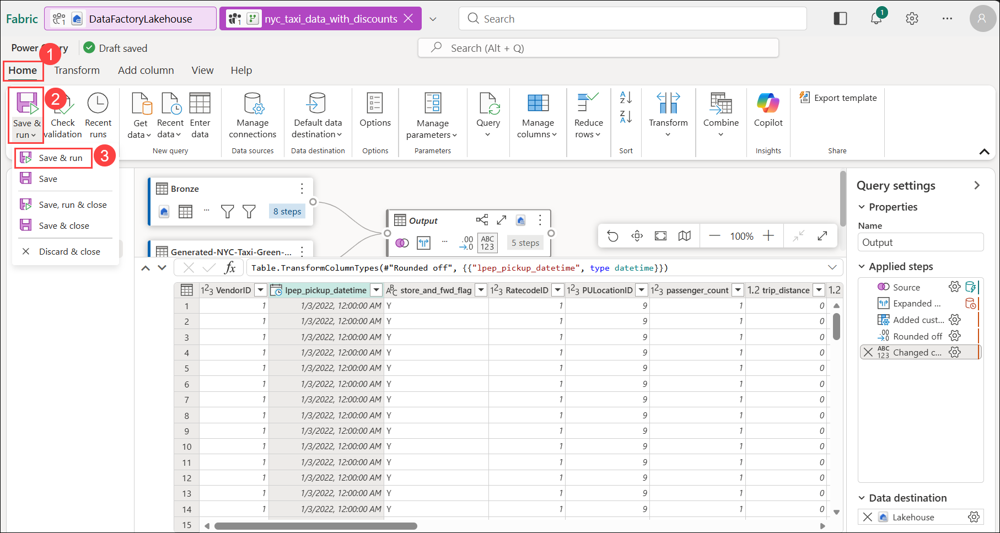

     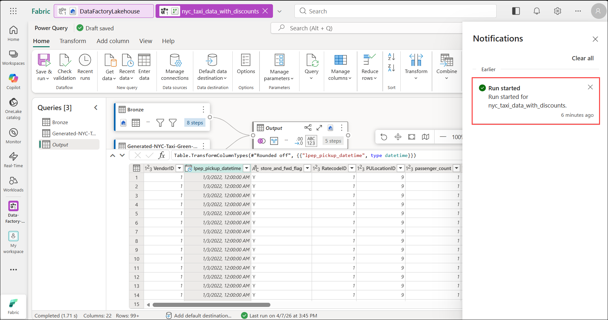

1. Now, click on **Data Factory- workspace (1)** on the left-sided navigation pane and select **DataFactoryLakehouse (2)** to view the new table loaded there.

     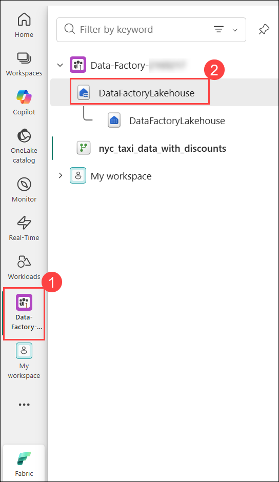

1. Confirm that the **Output (2)** table appears under **Tables (1)** if not, then click on the **ellipsis (...) (3)** next to Tables, and click **Refresh (4)**.

     

## Exercise 3: Automate and send notifications with Data Factory

### Task 1: Add an Office 365 Outlook activity to your pipeline

1. Click on **Data_Factory- (1)** Workspace from the left navigation pane, then select **Data_Factory- (2)** Workspace.

     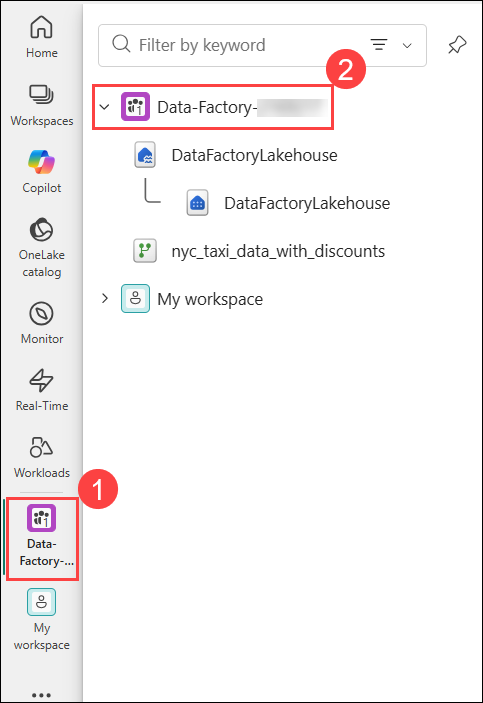

1. Click **New item (1)**, search for **Pipeline (2)**, and select **Pipeline (3)** to create a new data pipeline.

     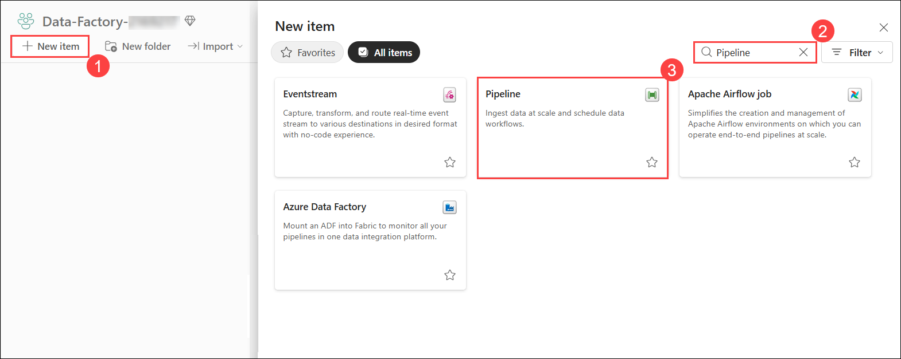

1. Provide a pipeline Name as **First_Pipeline (1)** and then select
    **Create (2)**.

     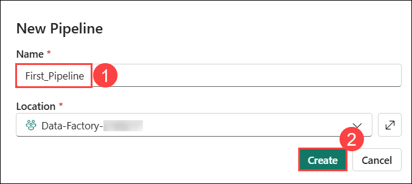

1. In the Home tab, click the **Copy activity icon (1)** on the toolbar and select **Add copy data activity (2)** to add a data movement step to your pipeline.

     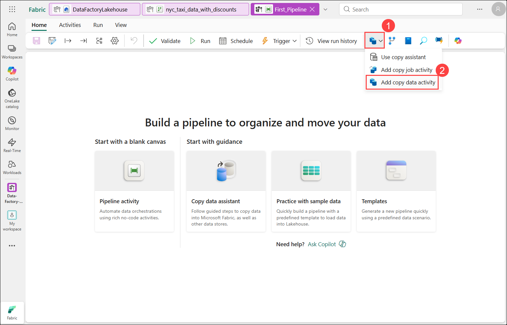

5. On the **Source (1)** section, enter the following settings and click on
    **Test connection (5).**

	|     |    |
	|------|------|
	|Connection|	dfconnection odl_user- **(2)**|
	|Connection type|	select HTTP **(3)**|
	|File format	| Select DelimitedText **(4)**|

     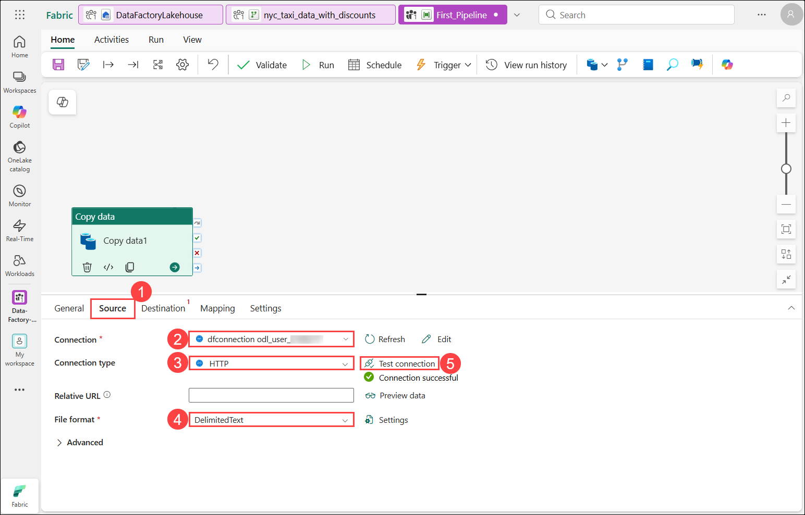

6. On the **Destination (1)** tab, enter the following settings.

	|    |    |
	|-----|----|
	|Connection	|**Lakehouse odl_user_ (2)**|
	|Lakehouse|	Select **DataFactoryLakehouse (3)**|
	|Root Folder	|select the **Table (4)** radio button.|
	|Table|  Select **+ New (5)** |

1. In the New table dialog- box,enter name of Table as **Generated-NYC-Taxi-Green-Discounts (6)** and click on **Create (5)** button.    

     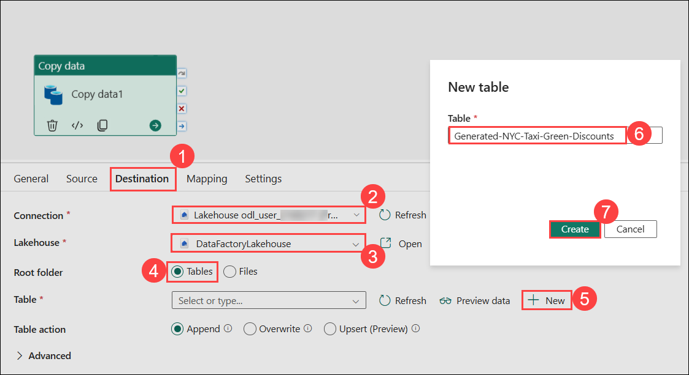

1. From the Home tab ribbon, select **Run**.

     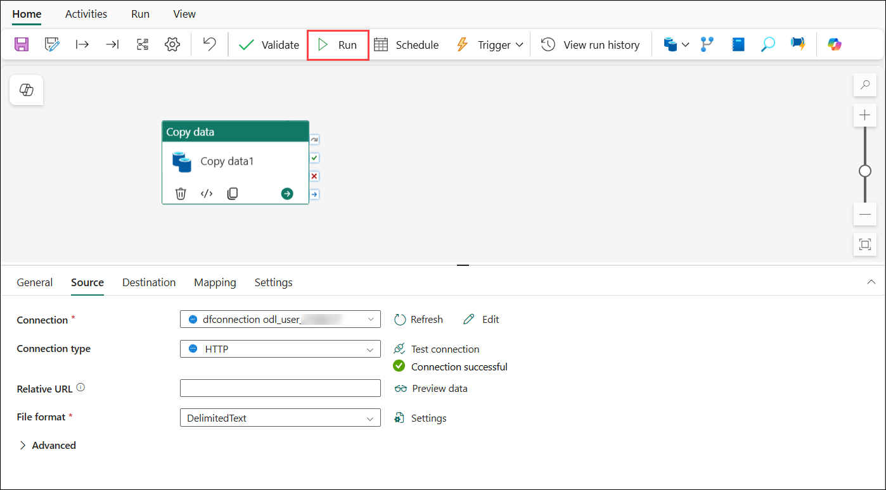

1. In the **Save and run?** dialog box, click on **Save and
    run** button.

     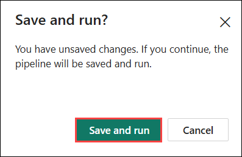

     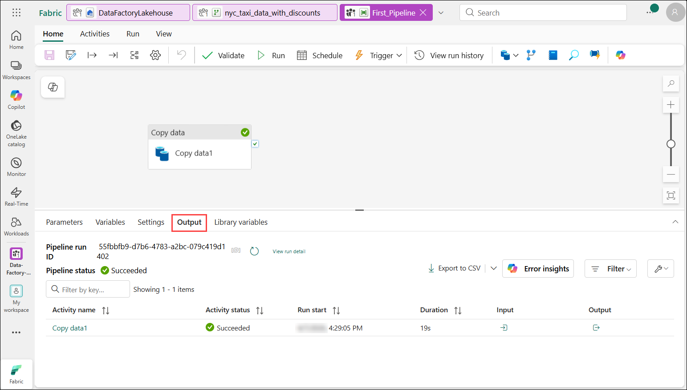

1. Select the **Activities (1)** tab in the pipeline editor and find the
    **Office Outlook (2)** activity.

     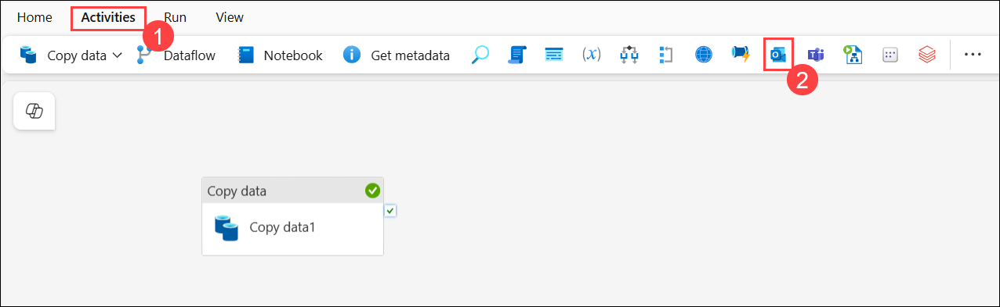

1. Select and drag the On success path (a green checkbox on the top right side of the activity in the pipeline canvas) from your Copy Data to your new Office 365 Email activity.

     

1. Select the Office 365 Outlook activity from the pipeline canvas, Go to the **Settings tab (1)**, click the **Connection dropdown (2)**, and select **Browse all (3)** to choose or create a connection.


     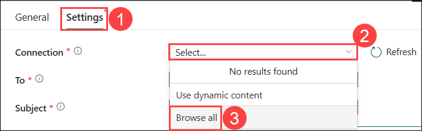

1. Select **Office 365 Email** from the available data sources to configure the email connection.

     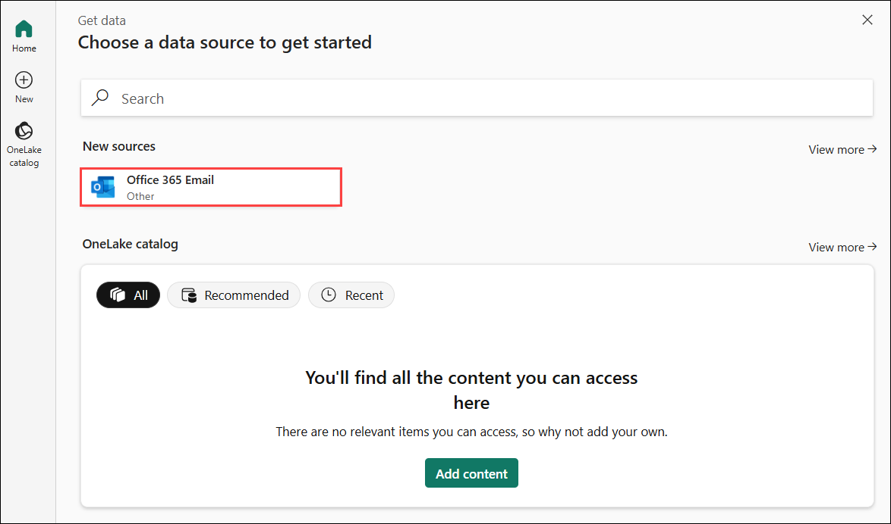     

1. In the **Connection credentials** section, then click **Sign in** to authenticate your Office 365 account.

     

1. Select your existing signed-in **ODL_User** account to authenticate and complete the connection setup for Office 365 Email.

     

1. Once authenticated, click on **Connect.**

          

1. In the Settings tab, enter the following details:

    - **Connection:** Select the **Outlook connection (1)** you establish for Connection. 

    - **To:** Enter your email address  

    - **Subject:** select the **Add dynamic content** option 
      it to display the pipeline expression builder canvas.

            

1. The **Pipeline expression builder** dialog appears. Enter the
    following expression, then select **OK**:

    ```
    @concat('DI in an Hour Pipeline Succeeded with Pipeline Run Id', pipeline().RunId)
    ```

1. For the **Body**, select the field again and choose the **View in expression builder** option when it appears below the text area. Add the following **expression (1)** in the **Pipeline expression builder** dialog that appears, then select **OK (2)**:

    ```
    @concat('RunID = ', pipeline().RunId, ' ; ', 'Copied rows ', activity('Copy data1').output.rowsCopied, ' ; ','Throughput ', activity('Copy data1').output.throughput)
    ```

     

     

    > **Note:** Replace **Copy data1** with the name of your own pipeline
    copy activity.

1. Finally select the **Home** tab at the top of the pipeline editor,
    and choose **Run**. 

     

1. Then select **Save and run** again on the confirmation dialog to execute these activities.

     

1. After the pipeline runs successfully, check your email to find the
    confirmation email sent from the pipeline.

     

     

### Task 2: Schedule pipeline execution

Once you finish developing and testing your pipeline, you can schedule
it to execute automatically.

1. On the **Home (1)** tab of the pipeline editor window, select **Schedule (2)**.

     

1. Click **+ Add schedule** to configure a new schedule for automatically running the pipeline.

     

1. Configure the schedule as required. The example here schedules the
    pipeline to execute daily at 8:00 PM until the end of the year.

1. Select **Daily (1)** under Repeat, set **Time of day** as **8:00 PM (2)** , and click **Save (3)** to schedule the pipeline execution.

     

1. Once the schedule is added, close **(X)** the pane.
     

### Task 3: Add a Dataflow activity to the pipeline

1. Hover over the line connecting the **Copy activity** and the
    **Office 365 Outlook** activity on your pipeline canvas, and select
    the **+ (1)** button to insert a new activity. Choose **Dataflow (2)** from the menu that appears.    

     

1. The newly created Dataflow activity is inserted between the Copy activity and the Office 365 Outlook activity, and selected automatically, showing its properties in the area below the canvas. 

1. Select the **Settings (1)** tab on the properties area, and then select your dataflow **nyc_taxi_data_with_discounts (2)** from the drop-down.

1. Select the **Home** tab at the top of the pipeline editor, choose **Run (3)**. 

       

1. Then select **Save and run** again on the confirmation dialog to execute these activities.

     

1. After the pipeline runs successfully, check your email to find the
    confirmation email sent from the pipeline.

     

     

### Task 4: Clean up resources

You can delete individual reports, pipelines, warehouses, and other
items or remove the entire workspace. Use the following steps to delete
the workspace you created for this tutorial.

1. Click **Data-Factory- (1)** from the left navigation pane, then select your **Data-Factory- (2)** opens the workspace item view.

     

2. Select the  **Workspace settings** option on the workspace page
    located at the top right corner.

     

3. Select **General tab** and **Remove this workspace** to clean up the resources.

     

## Summary

In this use case, you successfully built an end-to-end data integration solution using Data Factory in Microsoft Fabric. You started by creating a workspace and Lakehouse, then ingested raw data into a bronze table. You transformed and enriched the data using Dataflow Gen2 by applying filtering, schema changes, and combining multiple data sources to produce a curated output dataset. Finally, you orchestrated the entire workflow using pipelines, automated execution with scheduling, and implemented email notifications to monitor pipeline success, demonstrating how to design scalable, automated, and production-ready data engineering solutions within Fabric. 


## You have successfully completed this Use Case. Kindly click Next >> to proceed further.


