# Use Case 02: Implementing a Data Science scenario in Microsoft Fabric

## Introduction

The lifecycle of a Data science project typically includes (often,
iteratively) the following steps:

- Business understanding  
- Data acquisition  
- Data exploration, cleansing, preparation, and visualization  
- Model training and experiment tracking  
- Model scoring and generating insights

The goals and success criteria of each stage depend on collaboration,
data sharing and documentation. The Fabric data science experience
consists of multiple native-built features that enable collaboration,
data acquisition, sharing, and consumption in a seamless way.

In these tutorials, you take the role of a data scientist who has been
given the task to explore, clean, and transform a dataset containing the
churn status of 10000 customers at a bank. You then build a machine
learning model to predict which bank customers are likely to leave.

## Objective

-  Use the Fabric notebooks for data science scenarios.
-  Ingest data into a Fabric lakehouse using Apache Spark.
-  Load existing data from the lakehouse delta tables.
-  Clean and transform data using Apache Spark and Python based tools.
-  Create experiments and runs to train different machine learning models.
-  Register and track trained models using MLflow and the Fabric UI.
-  Run scoring at scale and save predictions and inference results to the lakehouse.
-  Visualize predictions in Power BI using DirectLake.

## Exercise 1

### Task 1: Create a workspace 

Before working with data in Fabric, create a workspace.

1. On the Microsoft **Fabric Home Page**, click on **+ New workspace** to create a new workspace.

     

1. In the **Create a workspace tab**, enter the following details and
    click on the **Apply (4)** button.
	
    |   |   |
    |----|---|
    |Name	| Enter **Data-Science- (1)**  |
    |Workspace type |	Select **Fabric (2)**, under Details you must see fabric capacity |
    |Semantic model storage format|	Select **Small semantic model storage format (3)** |

     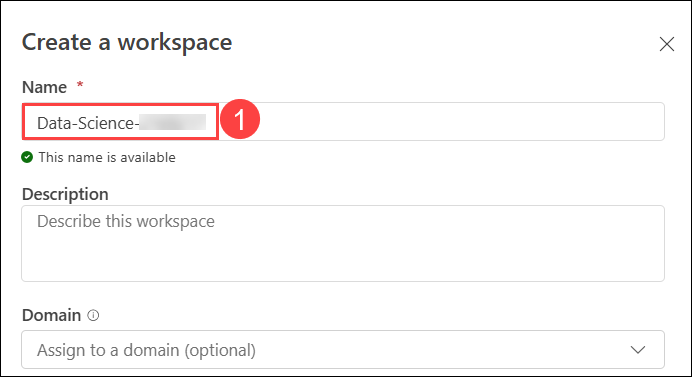

     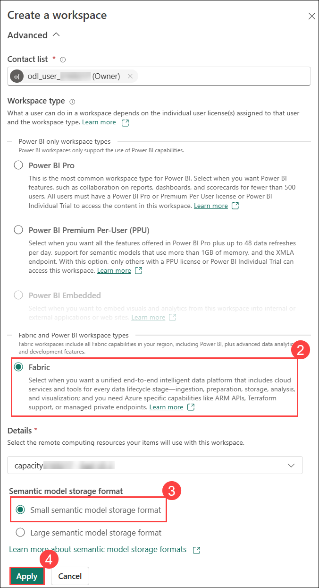

1. Wait for the deployment to complete. It may takes 2-3 minutes to
    complete. When your new workspace opens, it should be empty.

     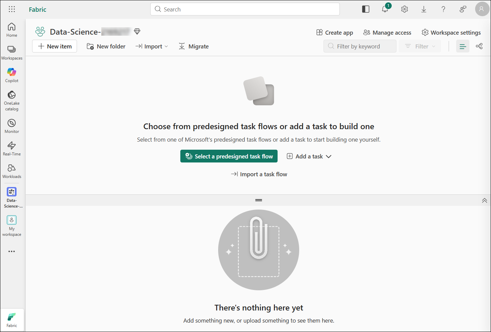

### Task 2: Create a lakehouse 

Now that you have a workspace, it's time to switch to the *Data
engineering* experience in the portal and create a data lakehouse for
the data files you're going to analyze.

1. In the workspace home page, click on **+ New item** to create a new resource.

     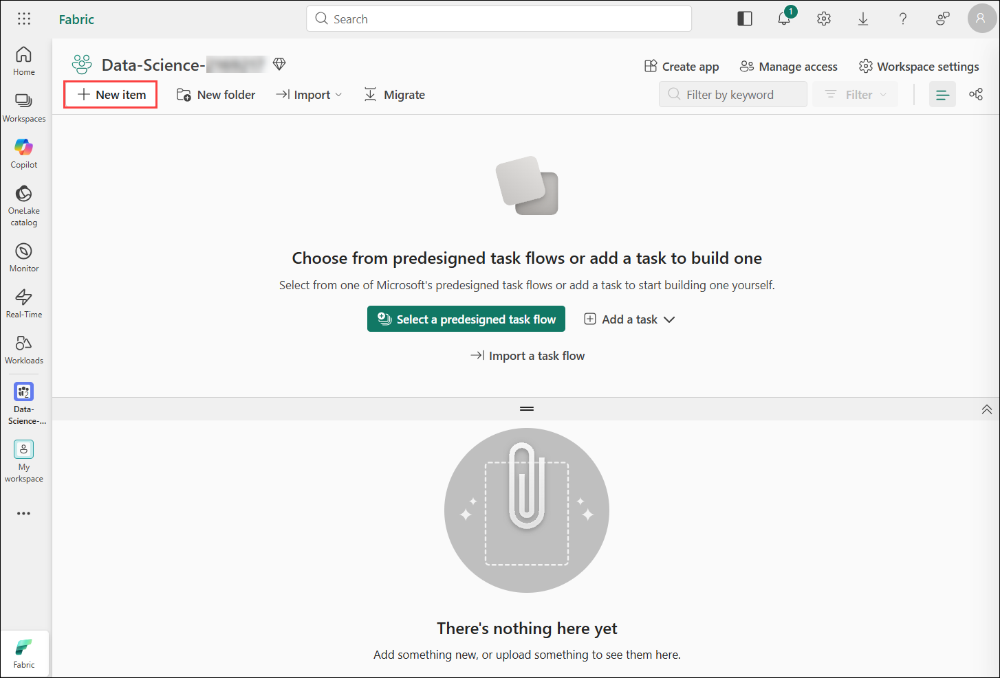

1. In the **New item** window, search for **Lakehouse (1)** in the search bar and select **Lakehouse (2)** from the results to create a new Lakehouse item.

     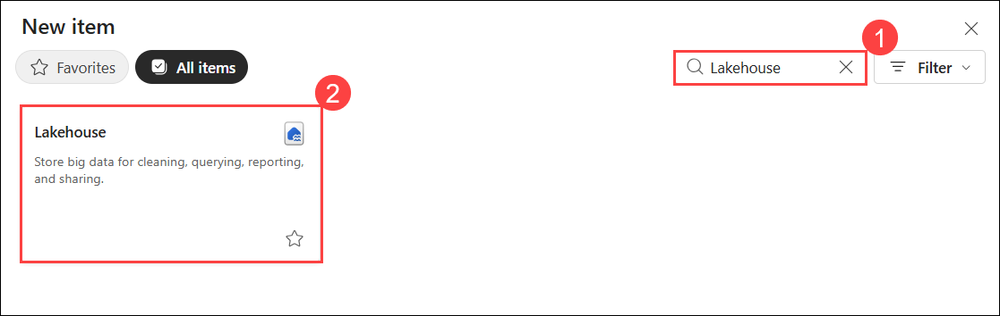

1. In the **New lakehouse** dialog box, enter **DataSciencelakehouse (1)** in the **Name** field, ensure the **Data-Science-** workspace is selected under **Location** and leave **Lakehouse schemas (2)** unchecked. Click **Create (3)** to proceed.

     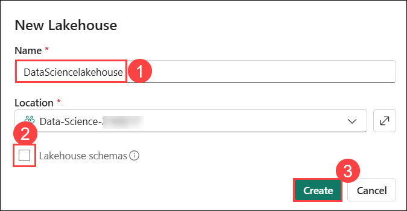     

    > **Note**: After a minute or so, a new empty lakehouse will be created. You
    need to ingest some data into the data lakehouse for analysis.

     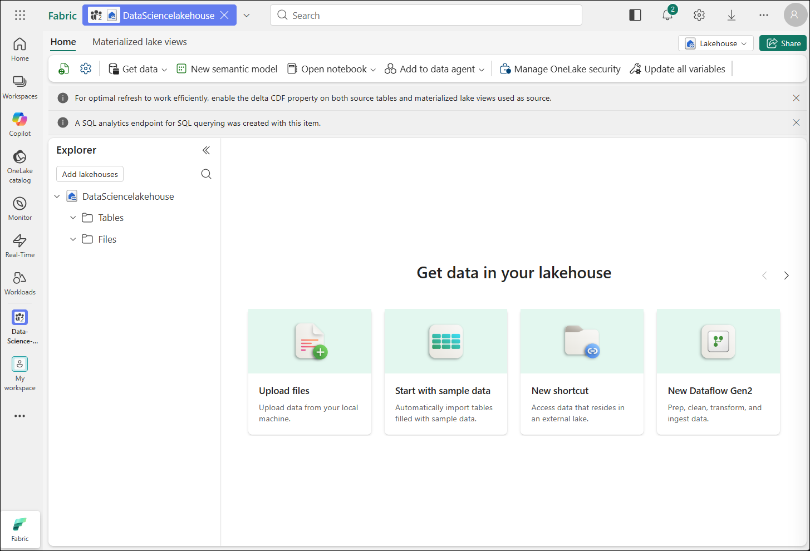 

    > **Note**: You will see a notification stating **Successfully created SQL
    endpoint**.

     

### Task 3: Install custom libraries and load the data

**Bank churn data**

The dataset contains churn status of 10,000 customers. It also includes
attributes that could impact churn such as:

- Credit score  
- Geographical location (Germany, France, Spain)  
- Gender (male, female)  
- Age  
- Tenure (years of being bank's customer)  
- Account balance  
- Estimated salary  
- Number of products that a customer has purchased through the bank  
- Credit card status (whether a customer has a credit card or not)  
- Active member status (whether an active bank's customer or not)  

The dataset also includes columns such as row number, customer ID, and
customer surname that should have no impact on customer's decision to
leave the bank.

The event that defines the customer's churn is the closing of the
customer's bank account. The column exited in the dataset refers to
customer's abandonment. There isn't much context available about these
attributes so you have to proceed without having background information
about the dataset. The aim is to understand how these attributes
contribute to the exited status.

1. In the **Lakehouse** page, click **Open notebook (1)** and select **Existing notebook (2)** to open a pre-created notebook for running and executing the lab steps.

     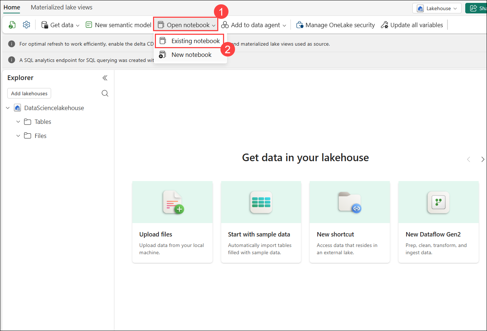 

     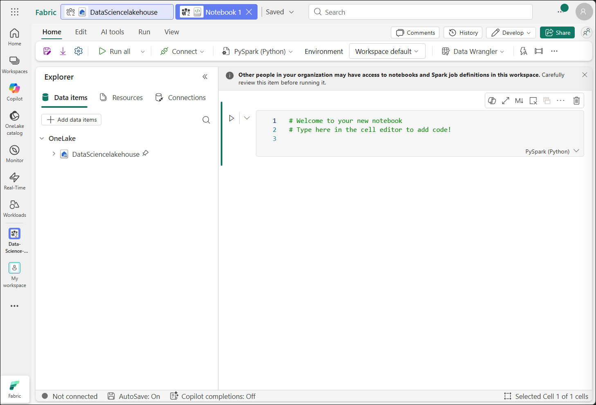 

1. Click **+ Code** to add a new code cell in the notebook.

     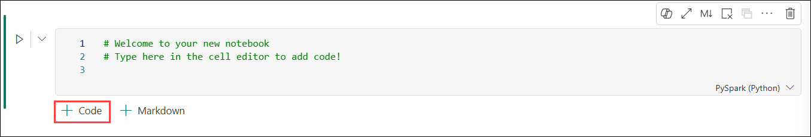 

1. Enter the following **code (1)** in the cell. This code use %pip install to install the imblearn library and then stores it in a Fabric lakehouse. Select the code cell and click on the **Run cell (2)** button to execute
    cell.
	
    ```
    # Use pip to install libraries
    %pip install imblearn
    ```

     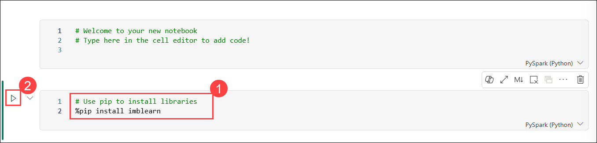 

     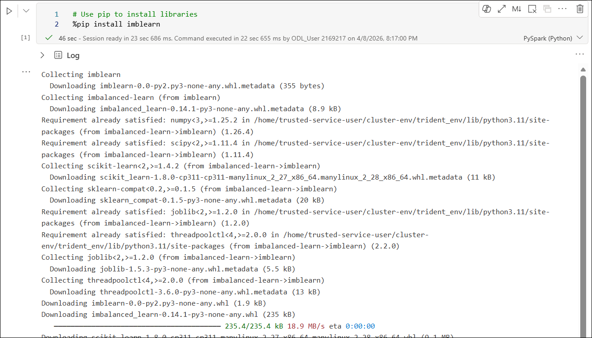           

	> **Note:** The PySpark kernel restarts after %pip install runs. Install
	the needed libraries before you run any other cells.

    > **Alert**: If you encounter an error in this step indicating an incompatibility with the *filelock* version follow these steps to correct it before continuing with this task:
 
      - Select the **+ Code (2)** icon below the latest cell output  

        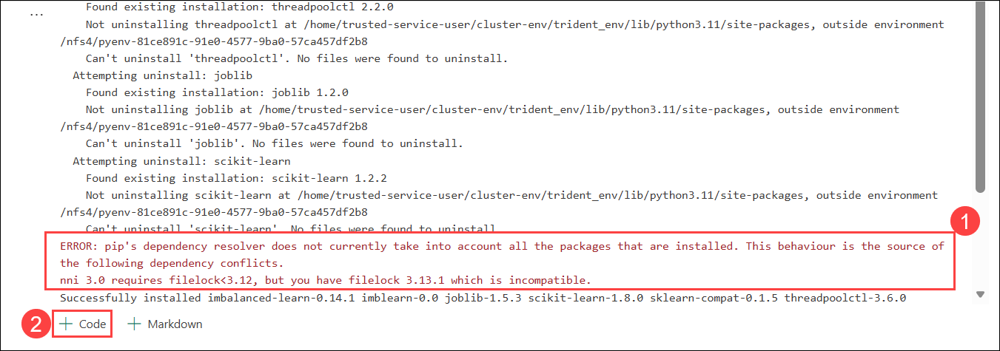 

      - Enter the following code in the cell **(1)**:  

        ```
        %pip install imbalanced-learn filelock<3.12
        ```

     - Select the **Run cell (2)** icon to execute the code    

       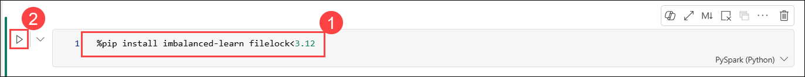                  

1. In your notebook, use the **+ Code** icon below the latest cell
    output to add a new code cell to the notebook.

     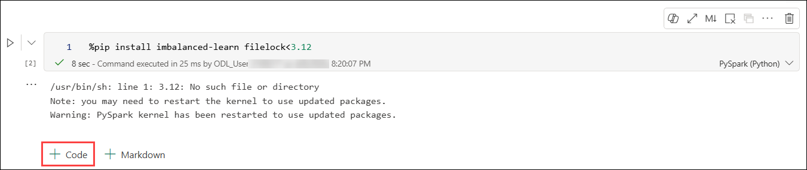    

1. Add the following configuration code in the cell **(1)** and click **Run cell (2)** to execute it, which sets parameters such as dataset location, file name, and whether to use full or sample data for training.
	
    ```
    IS_CUSTOM_DATA = False  # If TRUE, the dataset has to be uploaded manually
    
    IS_SAMPLE = False  # If TRUE, use only SAMPLE_ROWS of data for training; otherwise, use all data
    SAMPLE_ROWS = 5000  # If IS_SAMPLE is True, use only this number of rows for training
    
    DATA_ROOT = "/lakehouse/default"
    DATA_FOLDER = "Files/churn"  # Folder with data files
    DATA_FILE = "churn.csv"  # Data file name
    ```
    
     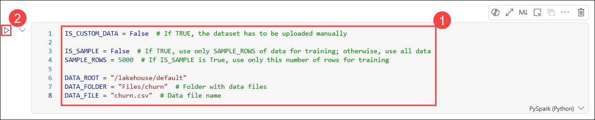  

     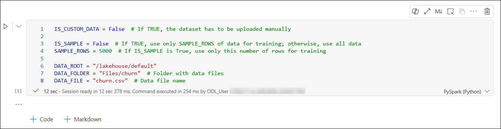     

1. In your notebook, use the **+ Code (1)** icon below the latest cell
    output to add a new code cell to the notebook.

1. Enter the following code in the cell **(2)**. Select the code cell and click on the **Run cell (3)** button to execute cell. As an **Output (4)** this code will download a publicly available version of the dataset and then stores it in a Fabric lakehouse.
	
    ```
    import os, requests
    if not IS_CUSTOM_DATA:
    # With an Azure Synapse Analytics blob, this can be done in one line
    
    # Download demo data files into the lakehouse if they don't exist
        remote_url = "https://synapseaisolutionsa.z13.web.core.windows.net/data/bankcustomerchurn"
        file_list = ["churn.csv"]
        download_path = "/lakehouse/default/Files/churn/raw"
    
        if not os.path.exists("/lakehouse/default"):
            raise FileNotFoundError(
                "Default lakehouse not found, please add a lakehouse and restart the session."
            )
        os.makedirs(download_path, exist_ok=True)
        for fname in file_list:
            if not os.path.exists(f"{download_path}/{fname}"):
                r = requests.get(f"{remote_url}/{fname}", timeout=30)
                with open(f"{download_path}/{fname}", "wb") as f:
                    f.write(r.content)
        print("Downloaded demo data files into lakehouse.")
    ```

     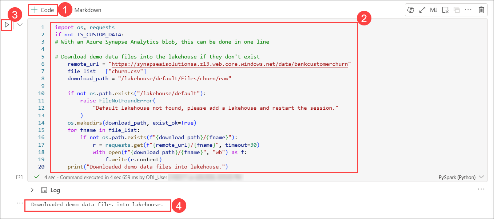

1. In your notebook, use the **+ Code (1)** icon below the latest cell
    output to add a new code cell to the notebook.

1. Enter the following code in the cell **(2)**. Select the code cell and click on the **Run cell (3)** button to execute cell to record the notebook start time for tracking execution duration.	

    ```
    # Record the notebook running time
    import time
    
    ts = time.time()
    ```

     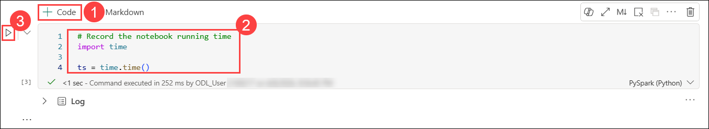

### Task 4: Explore and visualize data using Microsoft Fabric notebooks

The following code reads raw data from the **Files** section of the
lakehouse, and adds more columns for different date parts. Creation
of the partitioned delta table uses this information.

1. In your notebook, use the **+ Code (1)** icon below the latest cell
    output to add a new code cell to the notebook.

1. Enter the following code in the cell **(2)**. Select the code cell and click on the **Run cell (3)** button to execute cell to load the CSV data from the Lakehouse into a Spark DataFrame, **expand (4)** verify the execution completes successfully in the Spark jobs section.
	
    ```
    df = (
        spark.read.option("header", True)
        .option("inferSchema", True)
        .csv("Files/churn/raw/churn.csv")
        .cache()
    )
    ```

     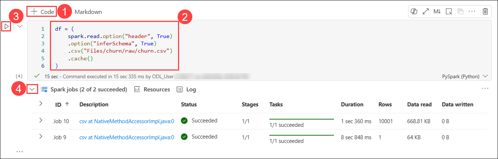

     > **Note**: You now need to convert the spark DataFrame to pandas DataFrame for easier
    processing and visualization.

1. In your notebook, use the **+ Code (1)** icon below the latest cell
    output to add a new code cell to the notebook.

1. Enter the following code in the cell **(2)**. Select the code cell and click on the **Run cell (3)** button to execute cell and verify successful execution in the Spark jobs section **(4)** to convert the Spark DataFrame into a Pandas DataFrame for easier data analysis.

    ```
    df = df.toPandas()
    ```
	
     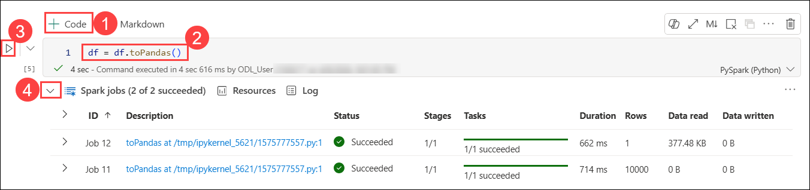

     > **Knowledge:** Explore the raw data with display, do some basic statistics and show chart views. You first need to import required libraries for data visualization such as seaborn, which is a Python data visualization library to provide a high-level interface for building visuals on DataFrames and arrays.

1. In your notebook, use the **+ Code (1)** icon below the latest cell
    output to add a new code cell to the notebook.

1. Enter the following code in the cell **(2)**. Select the code cell and click on the **Run cell (3)** button to execute cell and verify successful import of the required libraries for data analysis and visualization.
	
    ```
    import seaborn as sns
    sns.set_theme(style="whitegrid", palette="tab10", rc = {'figure.figsize':(9,6)})
    import matplotlib.pyplot as plt
    import matplotlib.ticker as mticker
    from matplotlib import rc, rcParams
    import numpy as np
    import pandas as pd
    import itertools
    ```
	
     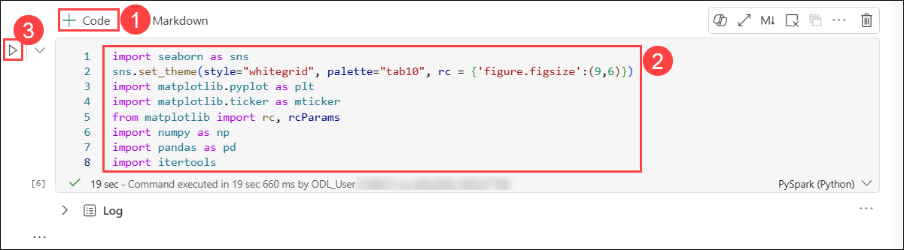

1. In your notebook, use the **+ Code (1)** icon below the latest cell
    output to add a new code cell to the notebook.

1. Enter the following code in the cell **(2)**. Select the code cell and click on the **Run cell (3)** button to execute cell and review the dataset summary output (**4)** to understand column types, unique values, and missing data.
	
    ```
    display(df, summary=True)
    ```
	
     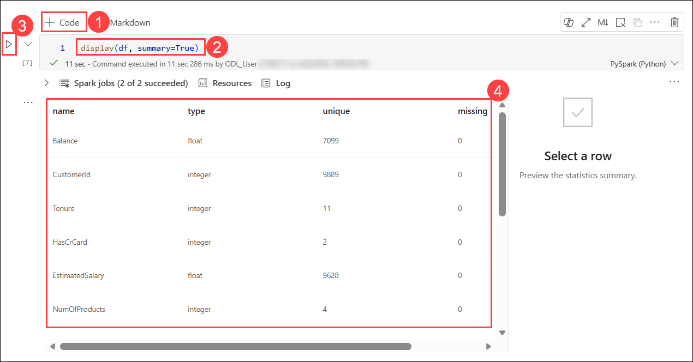

1. Under the notebook ribbon, click **AI tools (1)**, select **Data Wrangler (2)**, and choose the **df** DataFrame **(3)** to start data wrangling.
    
     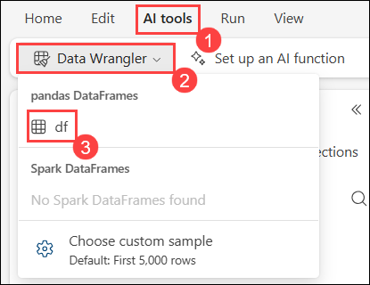

    > **Note**: Once the Data Wrangler is launched, a descriptive overview of the
    displayed data panel is generated.

     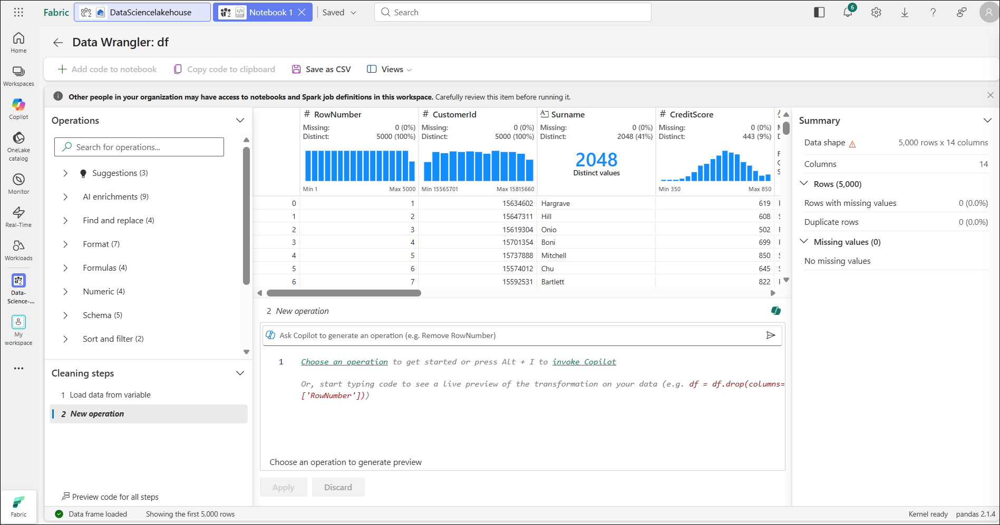

1. In df(Data Wrangler), under **Operations** expand **Find and replace (1)** and select **Drop duplicate rows (2)** to remove duplicate records from the dataset.

     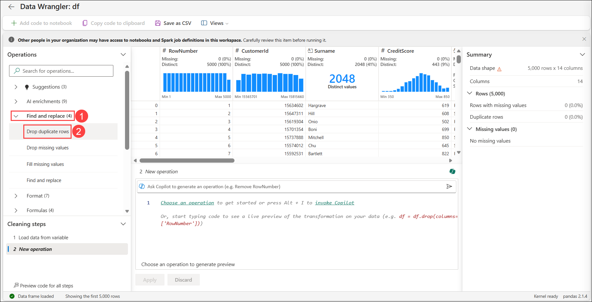

1. Select only the **RowNumber** and **CustomerId** column check boxes from the dropdown **(1)** and click **Apply (2)** to remove duplicate rows based on the selected columns.

     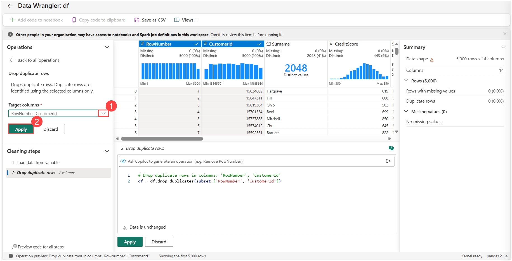

1. In df(Data Wrangler), under **Operations** expand **Find and replace (1)** and select **Drop missing values (2)** to remove rows with missing data.


     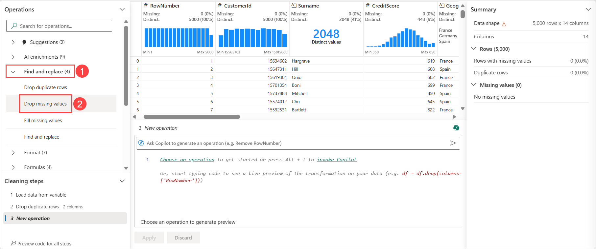

1. Under the Target columns, choose **Select all** from the dropdown **(1)** and click **Apply (2)** to remove rows with missing values based on the selected columns.
    

     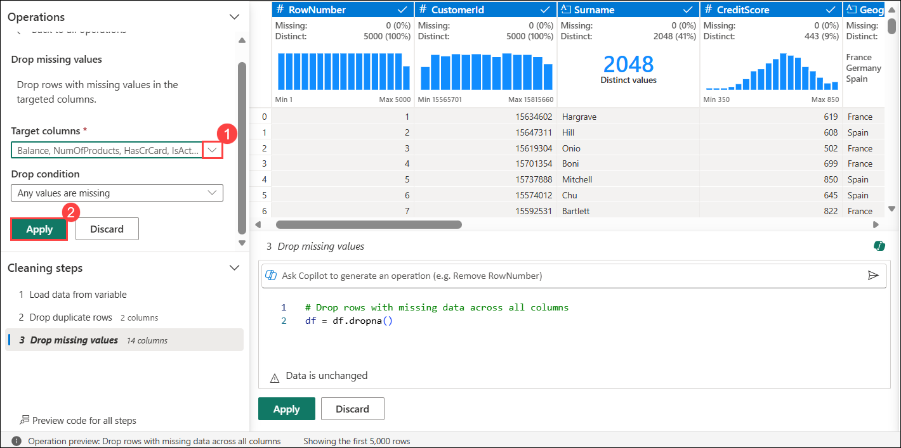

1. In df(Data Wrangler), under **Operations** expand **Schema (1)** and select **Drop columns** **(2)** to remove unnecessary columns from the dataset.

     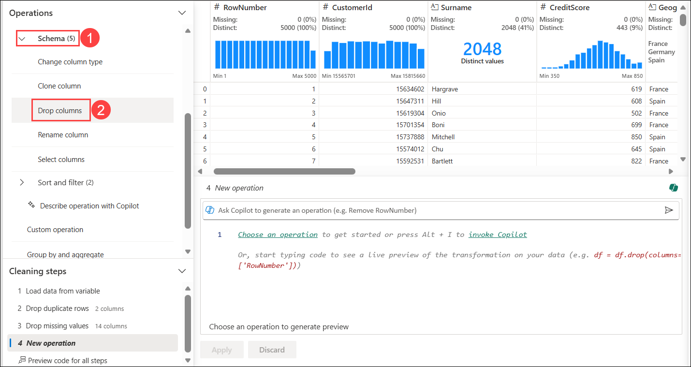

1. Under the Target columns, select **RowNumber**, **CustomerId**, **Surname** columns from the dropdown **(1)**, click **Apply (2)**, and then click **+ Add code to notebook (3)** to add the transformation code to your notebook.

     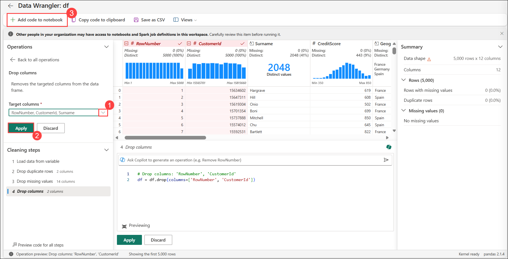

1. Examine the code generated by Data Wrangler 

1. Replace the genrated code with the following reference code in the cell **(1)**, then select the code cell and click on the **Run cell (2)** button to execute the data cleaning function, and review the cleaned dataset output **(3)**. 

    **Reference code:**
	
    ```
    # Modified version of code generated by Data Wrangler 
    # Modification is to add in-place=True to each step
    
    # Define a new function that include all above Data Wrangler operations
    def clean_data(df):
        # Drop rows with missing data across all columns
        df.dropna(inplace=True)
        # Drop duplicate rows in columns: 'RowNumber', 'CustomerId'
        df.drop_duplicates(subset=['RowNumber', 'CustomerId'], inplace=True)
        # Drop columns: 'RowNumber', 'CustomerId', 'Surname'
        df.drop(columns=['RowNumber', 'CustomerId', 'Surname'], inplace=True)
        return df
    
    df_clean = clean_data(df.copy())
    df_clean.head()
    ```

     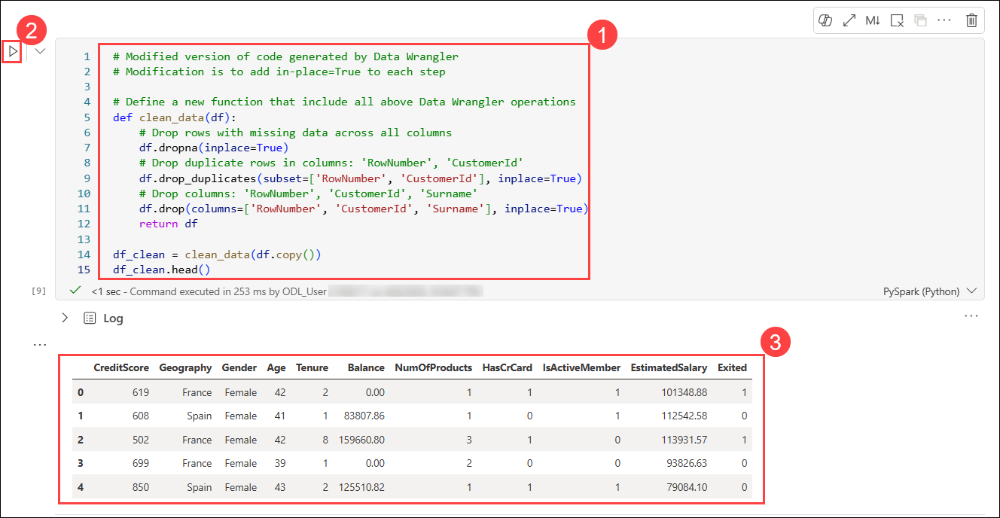

1. In your notebook, use the **+ Code (1)** icon below the latest cell
    output to add a new code cell to the notebook.

1. Enter the following code in the cell **(2)**. Select the code cell and click on the **Run cell (3)** button to execute cell and review the **output (4)** to determine categorical, numerical, and target attributes. 
	
    ```
    # Determine the dependent (target) attribute
    dependent_variable_name = "Exited"
    print(dependent_variable_name)
    # Determine the categorical attributes
    categorical_variables = [col for col in df_clean.columns if col in "O"
                            or df_clean[col].nunique() <=5
                            and col not in "Exited"]
    print(categorical_variables)
    # Determine the numerical attributes
    numeric_variables = [col for col in df_clean.columns if df_clean[col].dtype != "object"
                            and df_clean[col].nunique() >5]
    print(numeric_variables)
    ```
	
     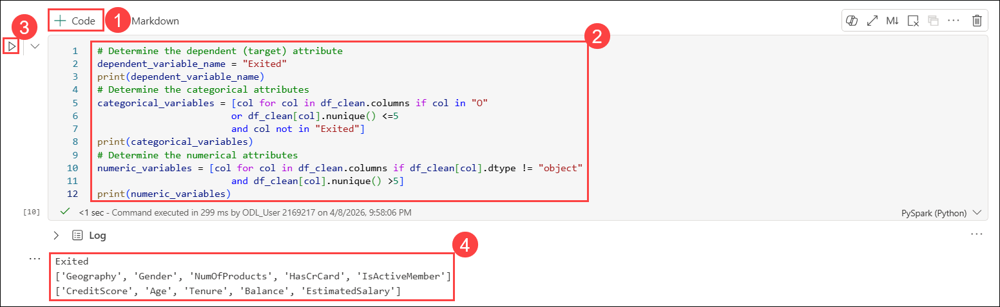

1. In your notebook, use the **+ Code (1)** icon below the latest cell
    output to add a new code cell to the notebook.

1. Enter the following code in the cell **(2)**. Select the code cell and click on the **Run cell (3)** button to execute cell and review the **output (4)** for the generated box plots to display the five-number summary-minimum, first quartile, median, third quartile, and maximum-for the numerical attributes.
	
    ```
    df_num_cols = df_clean[numeric_variables]
    sns.set(font_scale = 0.7) 
    fig, axes = plt.subplots(nrows = 2, ncols = 3, gridspec_kw =  dict(hspace=0.3), figsize = (17,8))
    fig.tight_layout()
    for ax,col in zip(axes.flatten(), df_num_cols.columns):
        sns.boxplot(x = df_num_cols[col], color='green', ax = ax)
    # fig.suptitle('visualize and compare the distribution and central tendency of numerical attributes', color = 'k', fontsize = 12)
    fig.delaxes(axes[1,2])
    ```

     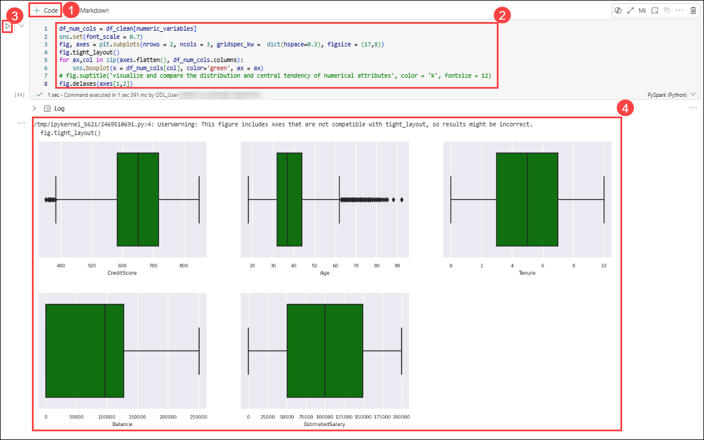

1. In your notebook, use the **+ Code (1)** icon below the latest cell
    output to add a new code cell to the notebook.

1. Enter the following code in the cell **(2)**. Select the code cell and click on the **Run cell (3)** button to execute cell and review the **output (4)** showing the distribution of exited versus nonexited customers across the categorical attributes.
	
    ```
    attr_list = ['Geography', 'Gender', 'HasCrCard', 'IsActiveMember', 'NumOfProducts', 'Tenure']
    df_clean['Exited'] = df_clean['Exited'].astype(str)
    fig, axarr = plt.subplots(2, 3, figsize=(15, 4))
    for ind, item in enumerate (attr_list):
        sns.countplot(x = item, hue = 'Exited', data = df_clean, ax = axarr[ind%2][ind//2])
    fig.subplots_adjust(hspace=0.7)
    ```

     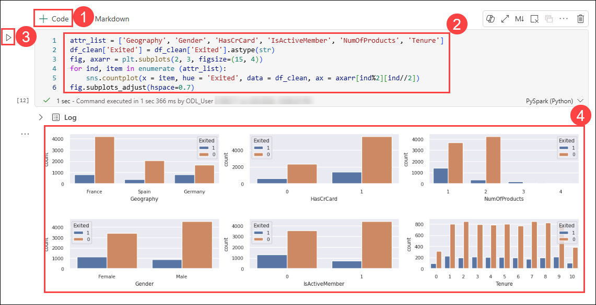

1. In your notebook, use the **+ Code (1)** icon below the latest cell
    output to add a new code cell to the notebook.

1. Enter the following code in the cell **(2)**. Select the code cell and click on the **Run cell (3)** button to execute cell and review the **output (4)** showing the frequency distribution of numerical attributes using histogram.
	
    ```
    columns = df_num_cols.columns[: len(df_num_cols.columns)]
    fig = plt.figure()
    fig.set_size_inches(18, 8)
    length = len(columns)
    for i,j in itertools.zip_longest(columns, range(length)):
        plt.subplot((length // 2), 3, j+1)
        plt.subplots_adjust(wspace = 0.2, hspace = 0.5)
        df_num_cols[i].hist(bins = 20, edgecolor = 'black')
        plt.title(i)
    plt.show()
    ```

     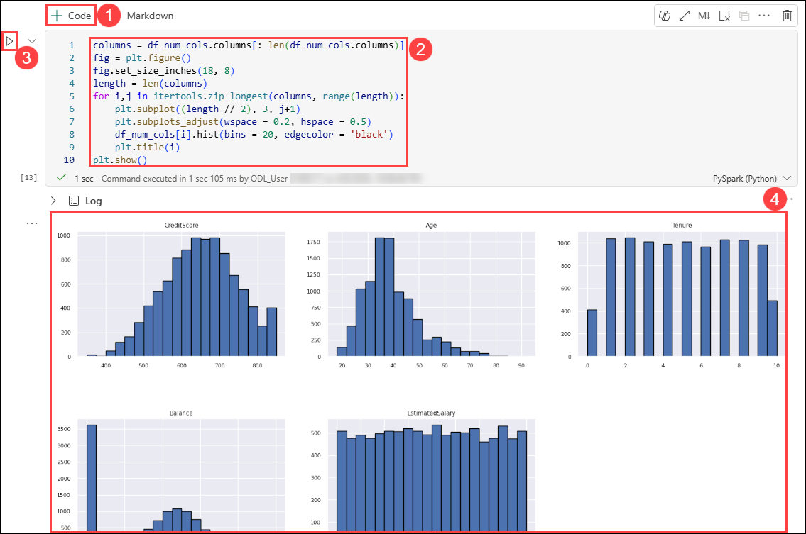

1. In your notebook, use the **+ Code (1)** icon below the latest cell
    output to add a new code cell to the notebook.

1. Enter the following code in the cell **(2)**. Select the code cell and click on the **Run cell (3)** button to execute cell to perform feature engineering to create new attributes derived from the existing ones.
	
    ```
    df_clean["NewTenure"] = df_clean["Tenure"]/df_clean["Age"]
    df_clean["NewCreditsScore"] = pd.qcut(df_clean['CreditScore'], 6, labels = [1, 2, 3, 4, 5, 6])
    df_clean["NewAgeScore"] = pd.qcut(df_clean['Age'], 8, labels = [1, 2, 3, 4, 5, 6, 7, 8])
    df_clean["NewBalanceScore"] = pd.qcut(df_clean['Balance'].rank(method="first"), 5, labels = [1, 2, 3, 4, 5])
    df_clean["NewEstSalaryScore"] = pd.qcut(df_clean['EstimatedSalary'], 10, labels = [1, 2, 3, 4, 5, 6, 7, 8, 9, 10])
    ```

     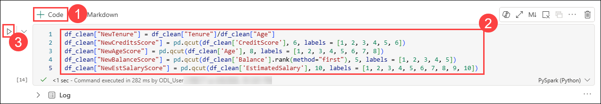

### Task 5: Use Data Wrangler to perform one-hot encoding

Data Wrangler can also be used to perform one-hot encoding. To do so,
re-open Data Wrangler. This time, select the df_clean data.

1. Use Data Wrangler to perform initial data cleansing, under the notebook ribbon select **AI tools (1)** tab, dropdown the **Data Wrangler (2)** and select the **df_clean (3)** data wrangler.

     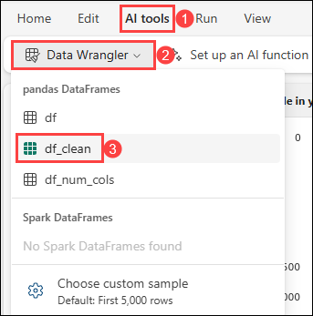)

1. In df(Data Wrangler), under **Operations** expand **Formulas (1)** and select **One-hot encode (2)** to convert categorical columns into numerical format.

     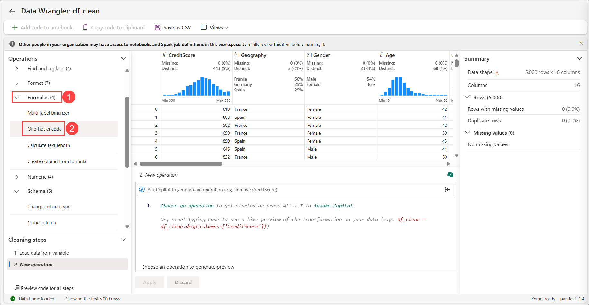

1. Under the Target columns, select **Geography** and **Gender** and then columns from the dropdown **(1)**, click **Apply (2)**.

     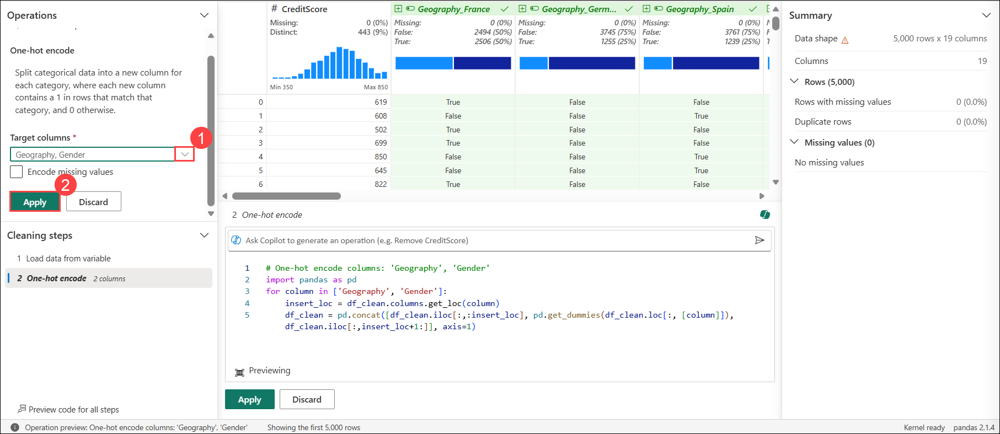

4. Select **+ Add code to notebook** at the top left to close Data
    Wrangler and add the code automatically.

     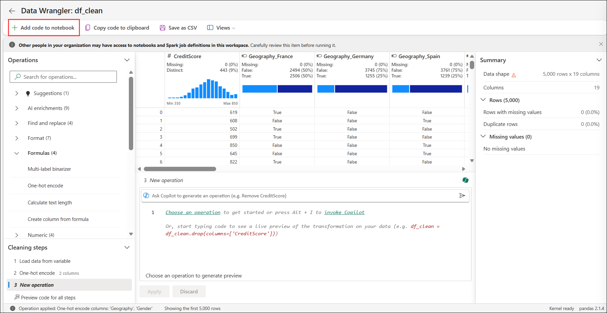

5. Review the generated code **(1)**, click on **Run cell (2)** button and review the **output (3)** to perform one-hot encoding on categorical columns, and r the transformed dataset.

     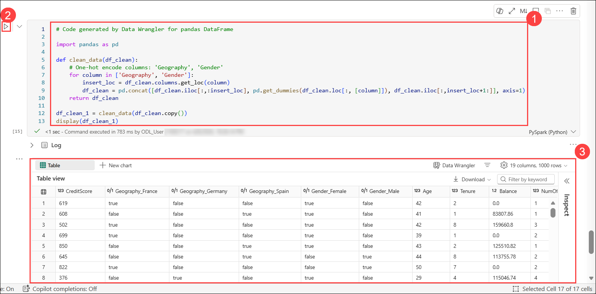

### Task 6: Create a delta table for the cleaned data

1. In your notebook, use the **+ Code (1)** icon below the latest cell
    output to add a new code cell to the notebook.

1. Enter the following code in the cell **(2)**. Select the code cell and click on the **Run cell (3)** button to execute cell and verify the message confirming the table is saved **(4)**.
	
    ```
    table_name = "df_clean"
    # Create a PySpark DataFrame from pandas
    sparkDF=spark.createDataFrame(df_clean) 
    sparkDF.write.mode("overwrite").format("delta").save(f"Tables/{table_name}")
    print(f"Spark DataFrame saved to delta table: {table_name}")
    ```

     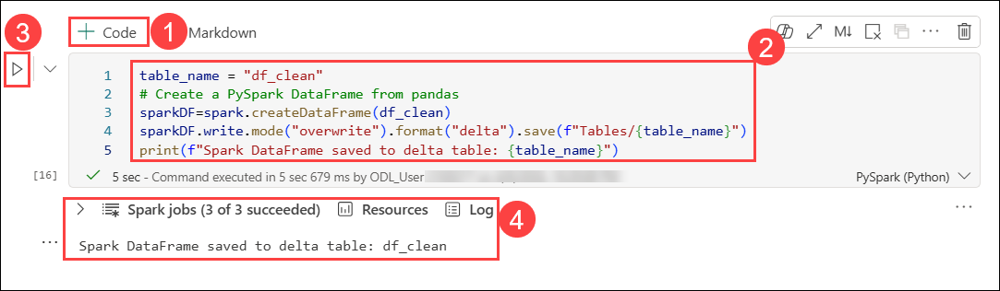

### Task 7: Train and register a machine learning model

Install the imbalanced-learn library (imported as imblearn) using %pip
install; this library provides techniques like SMOTE for addressing
imbalanced datasets. Since the PySpark kernel will restart after
installation, ensure this cell is run before executing any others.

1. In your notebook, use the **+ Code (1)** icon below the latest cell
    output to add a new code cell to the notebook.

1. Enter the following code in the cell **(2)**. Select the code cell and click on the **Run cell (3)** button to review the log **output (4)** to confirm the library is installed and kernel has been restarted successfully.

     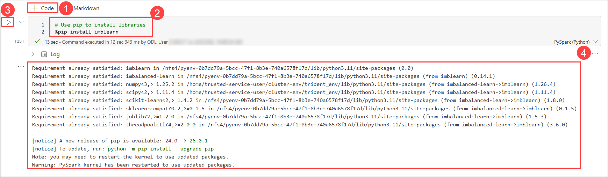

1. In your notebook, use the **+ Code (1)** icon below the latest cell
    output to add a new code cell to the notebook.

1. Enter the following code in the cell **(2)**. Select the code cell and click on the **Run cell (3)** button to execute  and reload the cleaned data, set a seed, and apply one-hot encoding for model readiness, and verify successful execution in the Spark jobs section **(4)**.
	
    ```
    SEED = 12345
    df_clean = spark.read.format("delta").load("Tables/df_clean").toPandas()

    import pandas as pd
    # FIX: Re-apply one-hot encoding (VERY IMPORTANT)
    df_clean = pd.get_dummies(df_clean, columns=['Geography', 'Gender'], drop_first=True)
    ```
	
     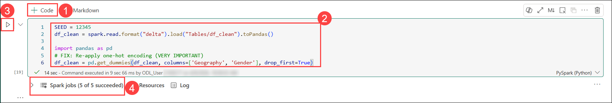

1. In your notebook, use the **+ Code (1)** icon below the latest cell
    output to add a new code cell to the notebook.

1. Enter the following code in the cell **(2)**. Select the code cell and click on the **Run cell (3)** button to execute and to generate an experiment for tracking and logging the model using.
	
    ```
    import mlflow
    # Set up the experiment name
    EXPERIMENT_NAME = "sample-bank-churn-experiment"  # MLflow experiment name
    ```
	
     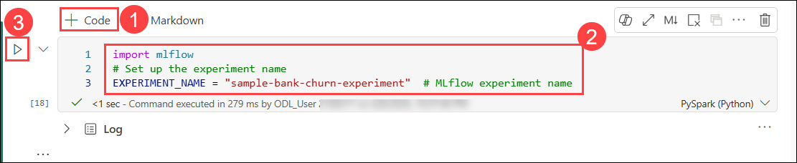

1. In your notebook, use the **+ Code (1)** icon below the latest cell
    output to add a new code cell to the notebook.

1. Enter the following code in the cell **(2)**. Select the code cell and click on the **Run cell (3)** button to execute and set experiment and autologging specifications. 
	
    ```
    mlflow.set_experiment(EXPERIMENT_NAME) # Use a date stamp to append to the experiment
    mlflow.autolog(exclusive=False)
    ```
	
     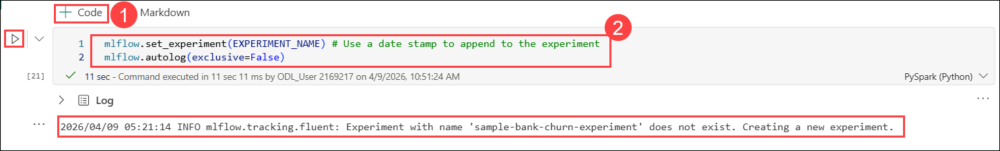

    > **Note**: With the data now loaded, the next step is to define and train machine learning models. This notebook demonstrates how to implement Random Forest and **LightGBM** using the **scikit-learn** and **lightgbm** libraries in just a few lines of code.

1. In your notebook, use the **+ Code (1)** icon below the latest cell
    output to add a new code cell to the notebook.

1. Enter the following code in the cell **(2)**. Select the code cell and click on the **Run cell (3)** button to execute to load libraries required for model training and evaluation, and review the log **output (4)** to confirm successful initialization.
	
    ```    
    # Import the required libraries for model training
    from sklearn.model_selection import train_test_split
    from lightgbm import LGBMClassifier
    from sklearn.ensemble import RandomForestClassifier
    from sklearn.metrics import accuracy_score, f1_score, precision_score, confusion_matrix, recall_score, roc_auc_score, classification_report
    ```
	
     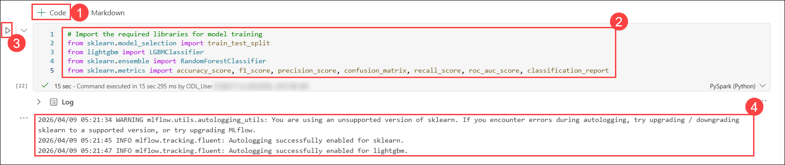

1. In your notebook, use the **+ Code (1)** icon below the latest cell
    output to add a new code cell to the notebook.

1. Enter the following code in the cell **(2)**. Select the code cell and click on the **Run cell (3)** button to execute to split the dataset into training and testing sets for model building.

    ```
    y = df_clean["Exited"]
    X = df_clean.drop("Exited",axis=1)
    # Train/test separation
    X_train, X_test, y_train, y_test = train_test_split(X, y, test_size=0.20, random_state=SEED)
    ```

     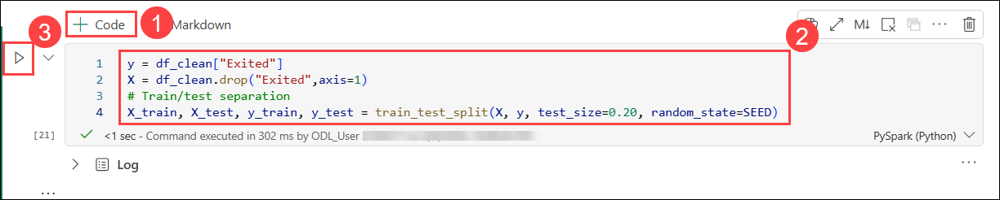

1. In your notebook, use the **+ Code (1)** icon below the latest cell
    output to add a new code cell to the notebook.

1. Enter the following code in the cell **(2)**. Select the code cell and click on the **Run cell (3)** button to execute to apply SMOTE for balancing the training dataset, and review the **output/logs (4)** to confirm successful execution.
	
    ```
    from collections import Counter
    from imblearn.over_sampling import SMOTE
    
    sm = SMOTE(random_state=SEED)
    X_res, y_res = sm.fit_resample(X_train, y_train)
    new_train = pd.concat([X_res, y_res], axis=1)
    ```

     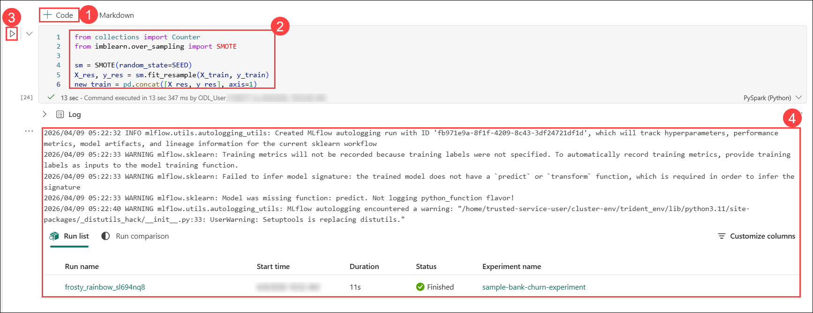

1. In your notebook, use the **+ Code** icon below the latest cell
    output to add a new code cell to the notebook.

1. Enter the following code in the cell **(1)**. Select the code cell and click on the **Run cell (2)** button to execute. Train the model using Random Forest with maximum depth of 4 and 4 features and review the **output (3)**.
	
    ```
    mlflow.sklearn.autolog(registered_model_name='rfc1_sm')  # Register the trained model with autologging
    rfc1_sm = RandomForestClassifier(max_depth=4, max_features=4, min_samples_split=3, random_state=1) # Pass hyperparameters
    with mlflow.start_run(run_name="rfc1_sm") as run:
        rfc1_sm_run_id = run.info.run_id # Capture run_id for model prediction later
        print("run_id: {}; status: {}".format(rfc1_sm_run_id, run.info.status))
        # rfc1.fit(X_train,y_train) # Imbalanced training data
        rfc1_sm.fit(X_res, y_res.ravel()) # Balanced training data
        rfc1_sm.score(X_test, y_test)
        y_pred = rfc1_sm.predict(X_test)
        cr_rfc1_sm = classification_report(y_test, y_pred)
        cm_rfc1_sm = confusion_matrix(y_test, y_pred)
        roc_auc_rfc1_sm = roc_auc_score(y_res, rfc1_sm.predict_proba(X_res)[:, 1])
    ```
	
     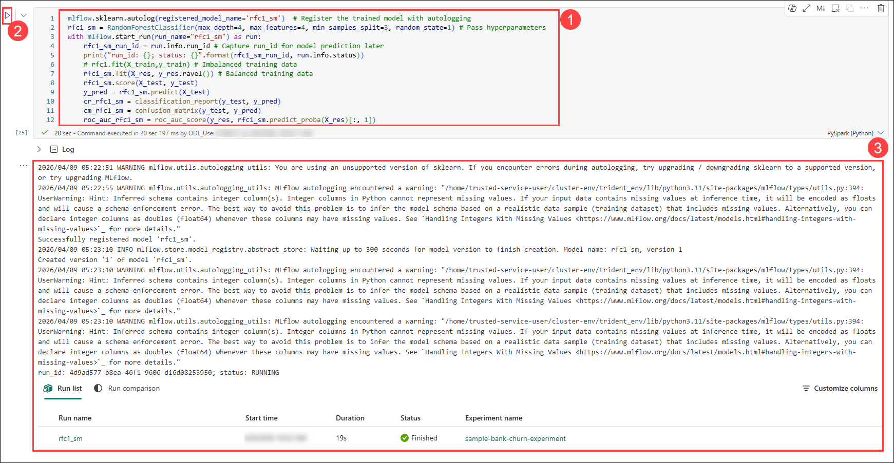

1. In your notebook, use the **+ Code** icon below the latest cell
    output to add a new code cell to the notebook.

1. Enter the following code in the cell **(1)**. Select the code cell and click on the **Run cell (2)** button to execute. Train the model using Random Forest with maximum depth of 8 and 6 and review the **output (3)**.
	
    ```
    mlflow.sklearn.autolog(registered_model_name='rfc2_sm')  # Register the trained model with autologging
    rfc2_sm = RandomForestClassifier(max_depth=8, max_features=6, min_samples_split=3, random_state=1) # Pass hyperparameters
    with mlflow.start_run(run_name="rfc2_sm") as run:
        rfc2_sm_run_id = run.info.run_id # Capture run_id for model prediction later
        print("run_id: {}; status: {}".format(rfc2_sm_run_id, run.info.status))
        # rfc2.fit(X_train,y_train) # Imbalanced training data
        rfc2_sm.fit(X_res, y_res.ravel()) # Balanced training data
        rfc2_sm.score(X_test, y_test)
        y_pred = rfc2_sm.predict(X_test)
        cr_rfc2_sm = classification_report(y_test, y_pred)
        cm_rfc2_sm = confusion_matrix(y_test, y_pred)
        roc_auc_rfc2_sm = roc_auc_score(y_res, rfc2_sm.predict_proba(X_res)[:, 1])
    ```

     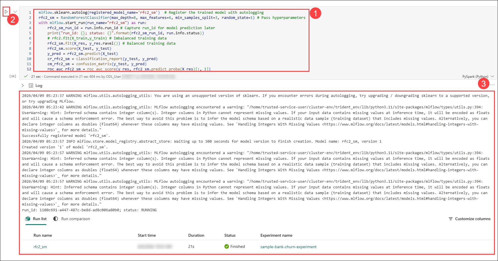

1. In your notebook, use the **+ Code** icon below the latest cell
    output to add a new code cell to the notebook.

1. Enter the following code in the cell **(1)**. Select the code cell and click on the **Run cell (2)** button to execute. Review the **output (3)** to train the model using LightGBM.
	
    ```
    # lgbm_model
    mlflow.lightgbm.autolog(registered_model_name='lgbm_sm')  # Register the trained model with autologging
    lgbm_sm_model = LGBMClassifier(learning_rate = 0.07, 
                            max_delta_step = 2, 
                            n_estimators = 100,
                            max_depth = 10, 
                            eval_metric = "logloss", 
                            objective='binary', 
                            random_state=42)
    
    with mlflow.start_run(run_name="lgbm_sm") as run:
        lgbm1_sm_run_id = run.info.run_id # Capture run_id for model prediction later
        # lgbm_sm_model.fit(X_train,y_train) # Imbalanced training data
        lgbm_sm_model.fit(X_res, y_res.ravel()) # Balanced training data
        y_pred = lgbm_sm_model.predict(X_test)
        accuracy = accuracy_score(y_test, y_pred)
        cr_lgbm_sm = classification_report(y_test, y_pred)
        cm_lgbm_sm = confusion_matrix(y_test, y_pred)
        roc_auc_lgbm_sm = roc_auc_score(y_res, lgbm_sm_model.predict_proba(X_res)[:, 1])
    ```
	
     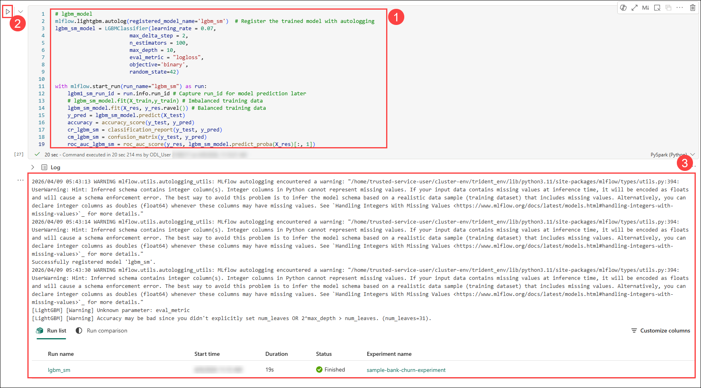

### Task 8: Experiments artifact for tracking model performance

1. Click the **Data-Science workspace (1)** from the left navigation pane and select your workspace **Data-Science-** **(2)** to view all created items.

     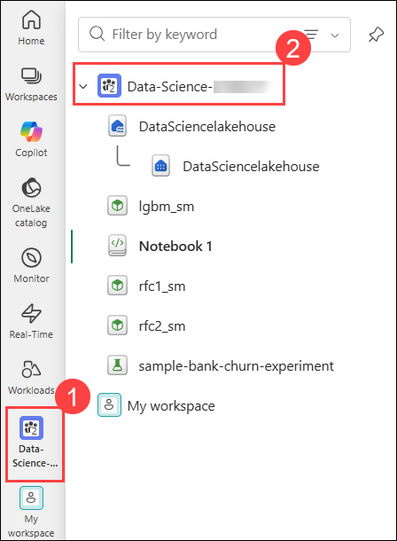

1. On the top right, click **Filter (1)**, select **Experiment (2)**, and choose the **sample-bank-churn-experiment (3)** to view the experiment details.

     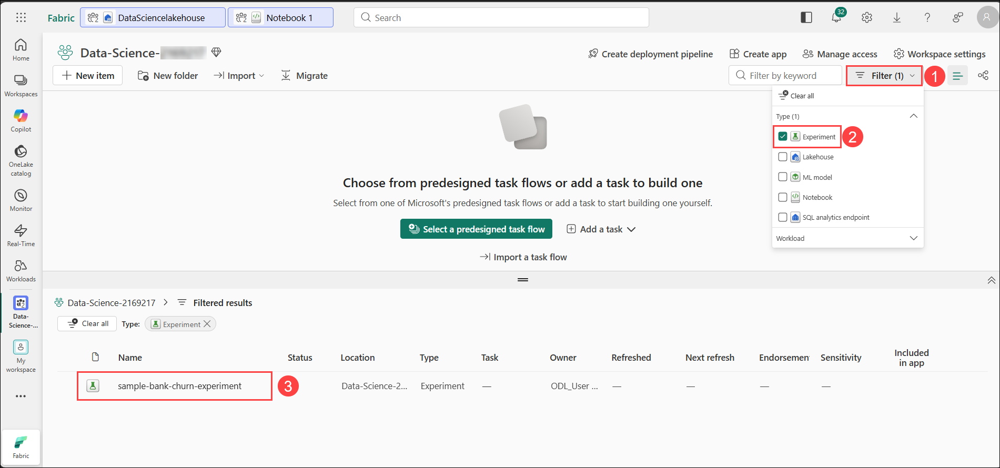

     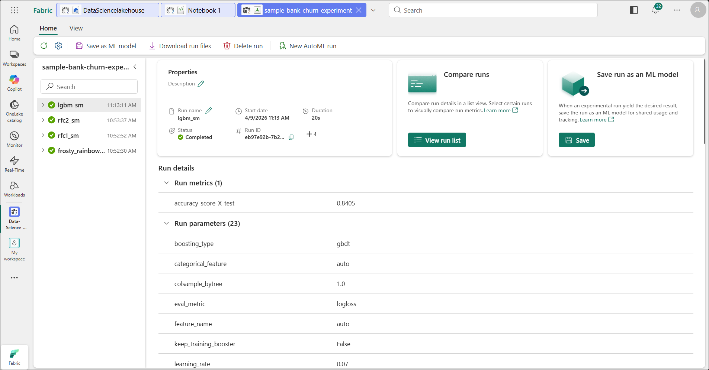

### Task 9: Assess the performances of the trained models on the validation dataset

1. Click the **Data-Science- workspace (1)** from the left navigation pane and select **Notebook 1** **(2)**.

     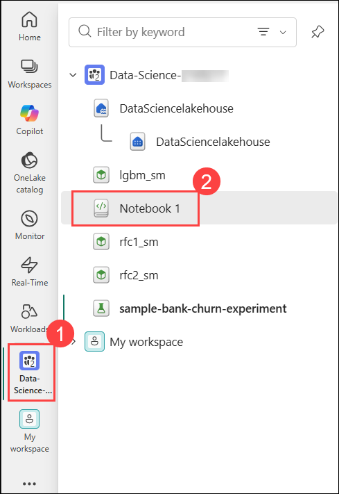

1. In your notebook, use the **+ Code (1)** icon below the latest cell
    output to add a new code cell to the notebook.

1. Enter the following code in the cell **(2)**. Select the code cell and click on the **Run cell (3)** button to load the trained models from MLflow, and verify the artifacts are downloaded successfully **(4)**.
	
    ```
    # Define run_uri to fetch the model
    # MLflow client: mlflow.model.url, list model
    load_model_rfc1_sm = mlflow.sklearn.load_model(f"runs:/{rfc1_sm_run_id}/model")
    load_model_rfc2_sm = mlflow.sklearn.load_model(f"runs:/{rfc2_sm_run_id}/model")
    load_model_lgbm1_sm = mlflow.lightgbm.load_model(f"runs:/{lgbm1_sm_run_id}/model")
    ```
	
     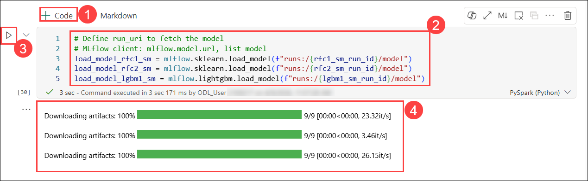

1. Click **+ Code (1)**, Enter the following code in the cell **(2)**. Select the code cell and click on the **Run cell (3)** button to generate predictions using the loaded models, then review the **output/logs (4)** to confirm execution.
    
	
    ```
    ypred_rfc1_sm = load_model_rfc1_sm.predict(X_test) # Random forest with maximum depth of 4 and 4 features
    ypred_rfc2_sm = load_model_rfc2_sm.predict(X_test) # Random forest with maximum depth of 8 and 6 features
    ypred_lgbm1_sm = load_model_lgbm1_sm.predict(X_test) # LightGBM
    ```
	
     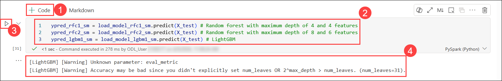

1. Click **+ Code (1)**, Enter the following code in the cell **(2)**. Select the code cell and click on the **Run cell (3)** button to load libraries required for visualization and analysis.

    ```
    import matplotlib.pyplot as plt
    import numpy as np
    import itertools
    ```

     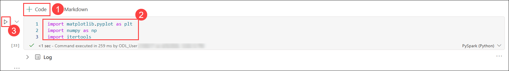


1. To evaluate the accuracy of the classification model, generate and
    analyze the confusion matrix using predictions from the validation
    dataset.

1. Click **+ Code (1)**, Enter the following code in the cell **(2)**. Select the code cell and click on the **Run cell (3)** button and review the **output(4)**.

    ```
    def plot_confusion_matrix(cm, classes,
                              normalize=False,
                              title='Confusion matrix',
                              cmap=plt.cm.Blues):
        print(cm)
        plt.figure(figsize=(4,4))
        plt.rcParams.update({'font.size': 10})
        plt.imshow(cm, interpolation='nearest', cmap=cmap)
        plt.title(title)
        plt.colorbar()
        tick_marks = np.arange(len(classes))
        plt.xticks(tick_marks, classes, rotation=45, color="blue")
        plt.yticks(tick_marks, classes, color="blue")
    
        fmt = '.2f' if normalize else 'd'
        thresh = cm.max() / 2.
        for i, j in itertools.product(range(cm.shape[0]), range(cm.shape[1])):
            plt.text(j, i, format(cm[i, j], fmt),
                     horizontalalignment="center",
                     color="red" if cm[i, j] > thresh else "black")
    
        plt.tight_layout()
        plt.ylabel('True label')
        plt.xlabel('Predicted label')
    ```
	
     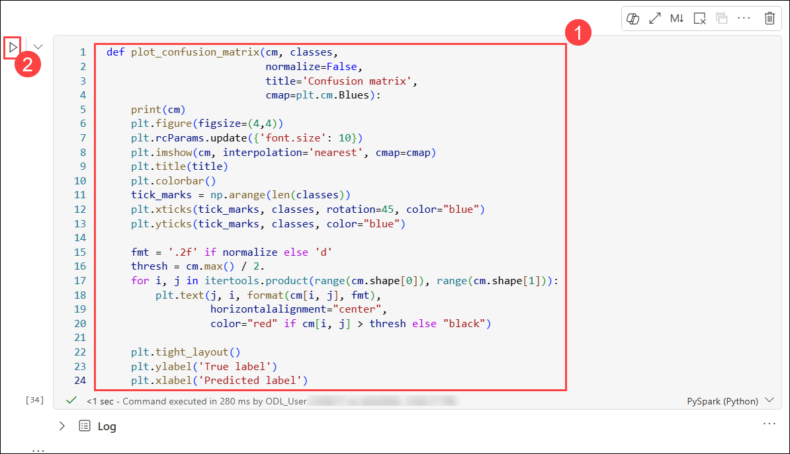

1. Confusion Matrix for Random Forest Classifier with maximum depth of
    4 and 4 features

1. Click **+ Code (1)**, Enter the following code in the cell **(2)**. Select the code cell and click on the **Run cell (3)** button and review the **output (4)**.
	
    ```
    cfm = confusion_matrix(y_test, y_pred=ypred_rfc1_sm)
    plot_confusion_matrix(cfm, classes=['Non Churn','Churn'],
                          title='Random Forest with max depth of 4')
    tn, fp, fn, tp = cfm.ravel()
    ```
 
     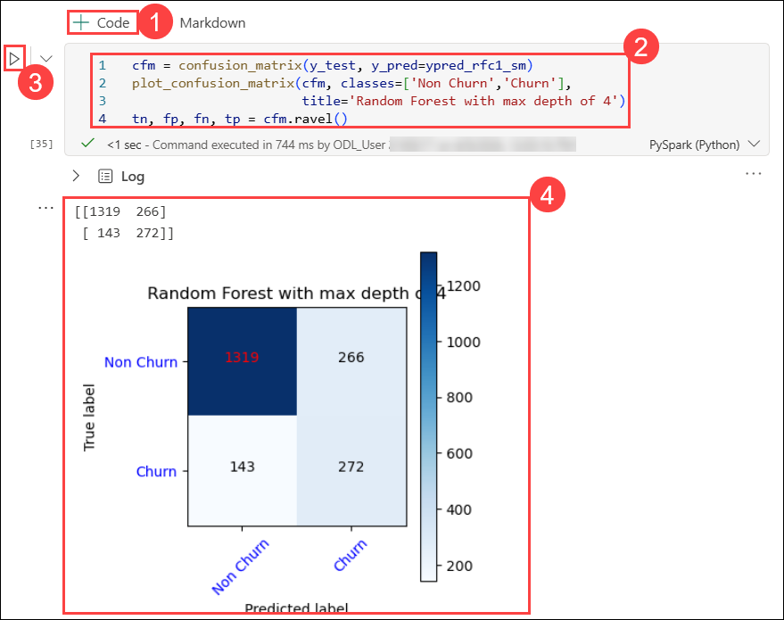

1. Confusion Matrix for Random Forest Classifier with maximum depth of
    8 and 6 features.

1. Click **+ Code (1)**, Enter the following code in the cell **(2)**. Select the code cell and click on the **Run cell (3)** button and review the **output (4)**.
	
    ```
    cfm = confusion_matrix(y_test, y_pred=ypred_rfc2_sm)
    plot_confusion_matrix(cfm, classes=['Non Churn','Churn'],
                          title='Random Forest with max depth of 8')
    tn, fp, fn, tp = cfm.ravel()
    ```
	
     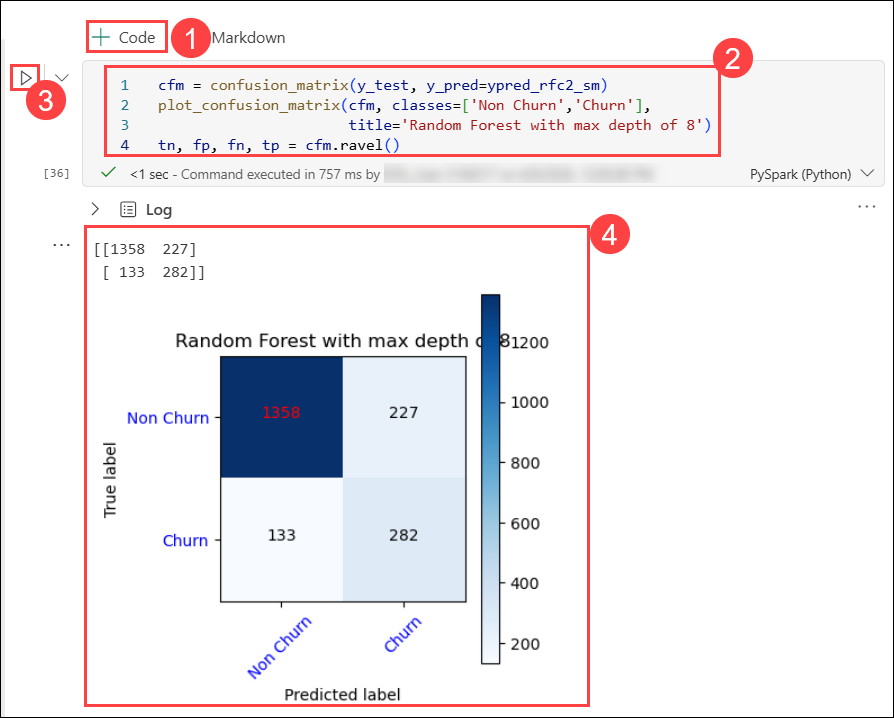

1. Confusion Matrix for LightGBM. 

1. Click **+ Code (1)**, Enter the following code in the cell **(2)**. Select the code cell and click on the **Run cell (3)** button and review the **output (4)**.
	
    ```
    cfm = confusion_matrix(y_test, y_pred=ypred_lgbm1_sm)
    plot_confusion_matrix(cfm, classes=['Non Churn','Churn'],
                          title='LightGBM')
    tn, fp, fn, tp = cfm.ravel()
    ```
	
     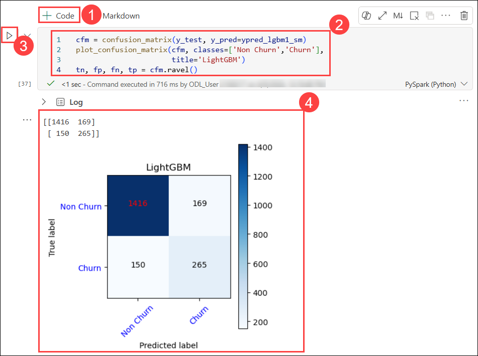

### Task 10: Save results for Power BI

1. Save the delta frame to the lakehouse, to move the model prediction
    results to a Power BI visualization.

2. Load the test data. Click **+ Code (1)**, Enter the following code in the cell **(2)**. Select the code cell and click on the **Run cell (3)** button and review the **output (4)**.
	
    ```
    df_pred = X_test.copy()
    df_pred['y_test'] = y_test
    df_pred['ypred_rfc1_sm'] = ypred_rfc1_sm
    df_pred['ypred_rfc2_sm'] =ypred_rfc2_sm
    df_pred['ypred_lgbm1_sm'] = ypred_lgbm1_sm
    table_name = "df_pred_results"
    sparkDF=spark.createDataFrame(df_pred)
    sparkDF.write.mode("overwrite").format("delta").option("overwriteSchema", "true").save(f"Tables/{table_name}")
    print(f"Spark DataFrame saved to delta table: {table_name}")
    ```

     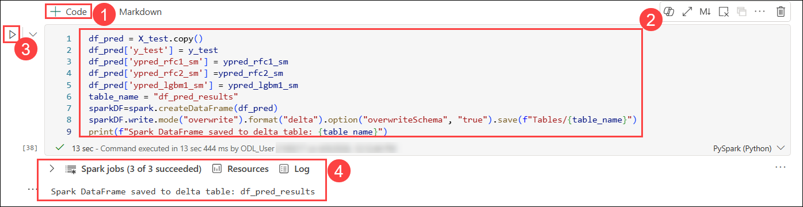

1. In the Explorer pane, expand **DataSciencelakehouse (1)**, open **Tables (2)**, and verify that **df_clean** and **df_pred_results (3)** are successfully created.
    
     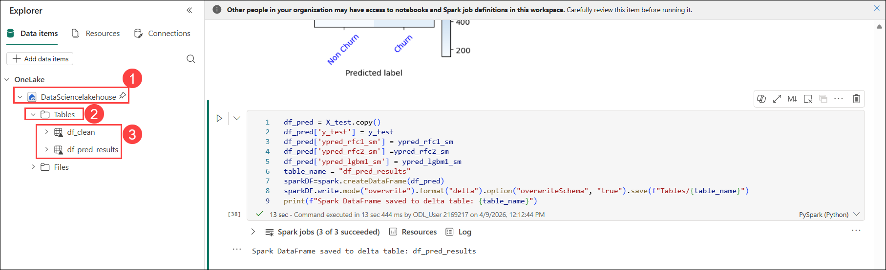

### Task 11: Create a semantic model

1. Click the **Data-Science- workspace (1)** from the left navigation pane and select **DataSciencelakehouse** **(2)**.

     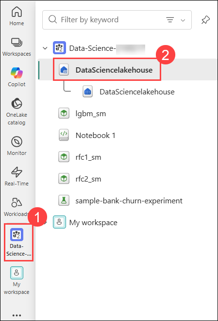

1. Select **New semantic model** on the top ribbon.

     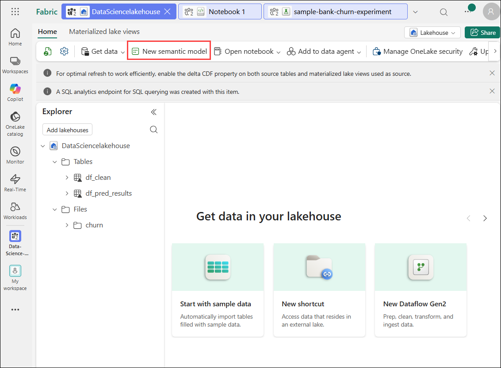

1. Enter **bank churn predictions (1)** as the semantic model name, verify the correct workspace is selected **(2)**, select the **df_pred_results** table **(3)**, and click **Confirm (4)** to create the semantic model.


     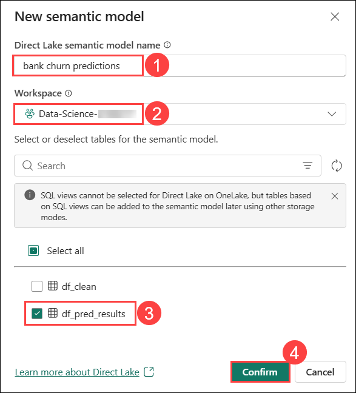

1. Select **Data-Science- (1)** in the left navigation pane, select **bank churn predictions (2)** semantic model.

     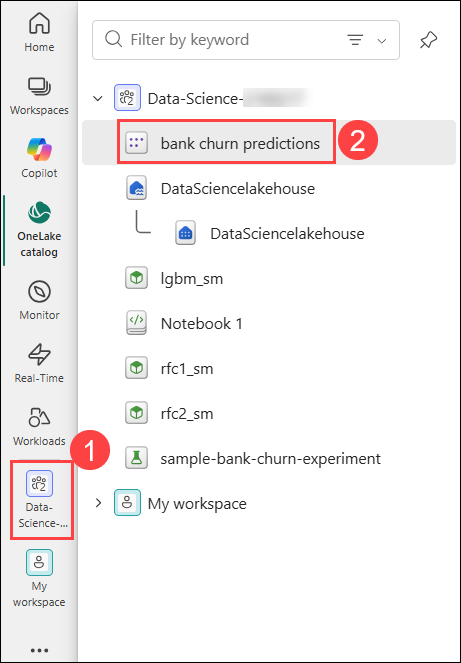

1. From the semantic model pane, you can view all the tables. You have
    options to create reports either from scratch, paginated report, or
    let Power BI automatically create a report based on your data. For
    this tutorial. Click **Explore (1)** and select **Auto-create a report (2)** to automatically generate a report from the semantic model.

     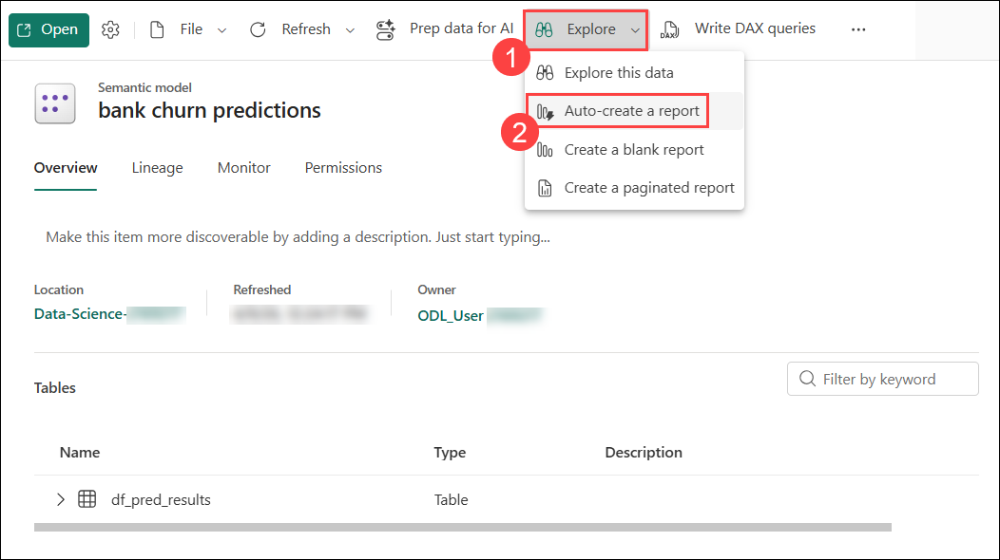

1. Select **View report now**. Save this report for the future by selecting **Save** from the top ribbon.

     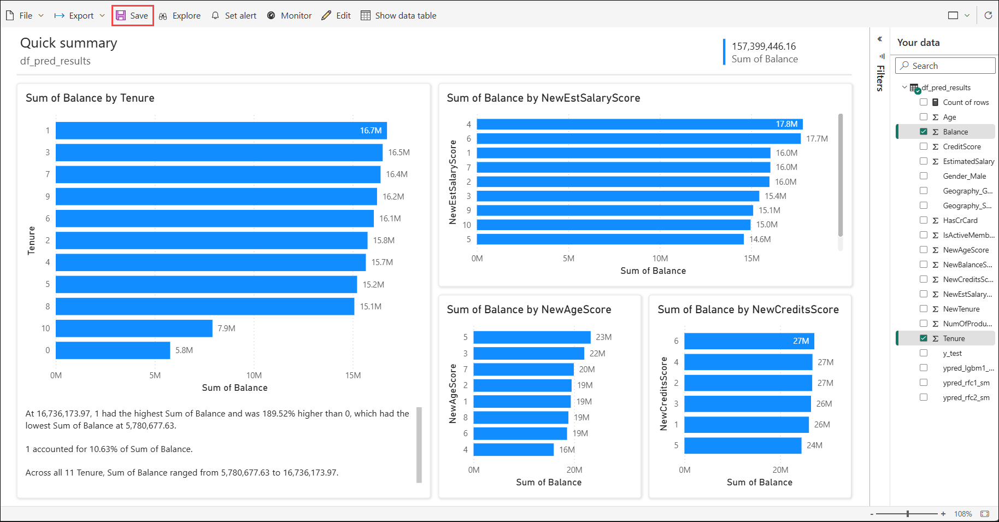

1. In the **Save your replort** dialog box, enter a name for your report as **Bank churn (1)** and select **Save (2)**.

     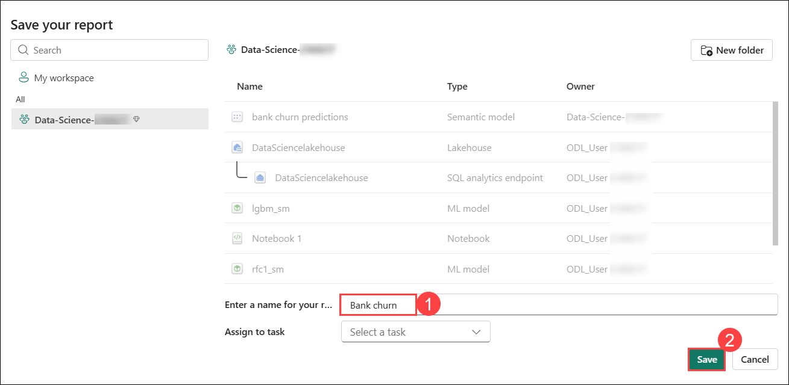

1. Click the **Data-Science- workspace (1)** from the left navigation pane, select **bank churn predictions (2)** semantic model in the left navigation pane.

     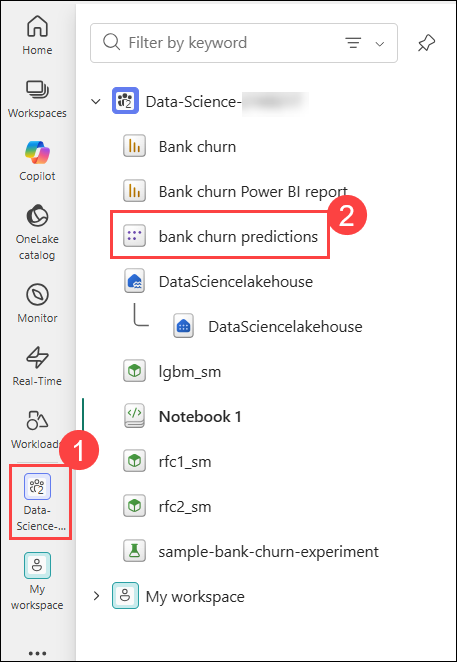

8. Select **Open data model.**

     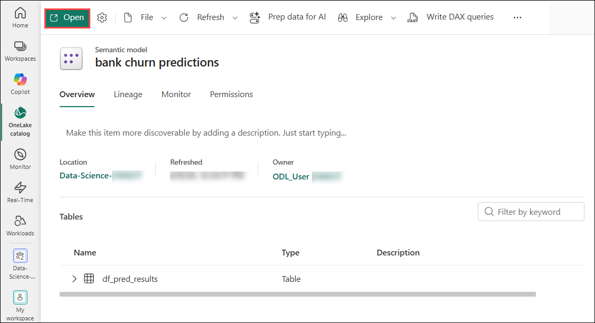

9. In Home page, click **Viewing (1)** and select **Editing (2)** to switch to edit mode and enable making changes to the report.


     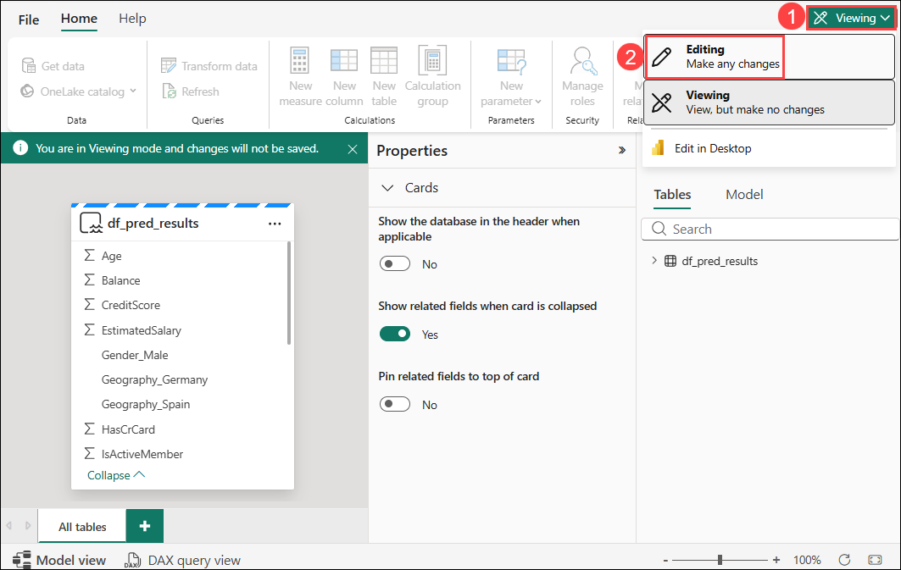

### Task 12: Add new measures

1. Add a new measure for the churn rate.

1. Select **New measure (1)** in the top ribbon to add a new item named **Measure** to the dataset. This action also opens a **formula bar (2)** above the table.

     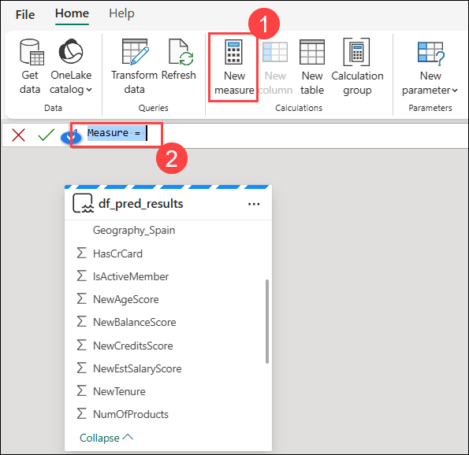

1. To determine the average predicted churn rate, replace **Measure =** in
    the formula bar with:

     ```
     Churn Rate = AVERAGE(df_pred_results[CreditScore])
     ```

1. Click the **check mark (2)** to save it, select the created **Churn Rate measure (3)**. In the Properties set the format from **General** to **Percentage (4)**, and adjust decimal places as 1 **(5)**.

      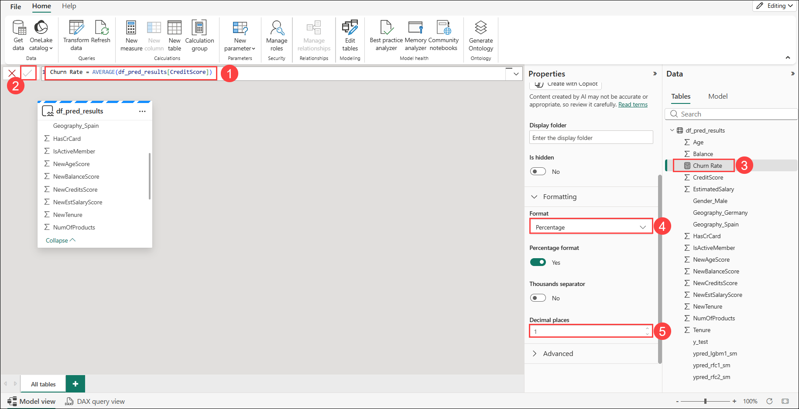

1. Click **New measure (1)**, enter the following formula **(2)** in the formula bar To determine the total number of customers. Click the **check mark (3)** to save it, and verify the **Customers (4)** measure is created.

	```
    Customers = COUNT(df_pred_results[CreditScore])
    ```

     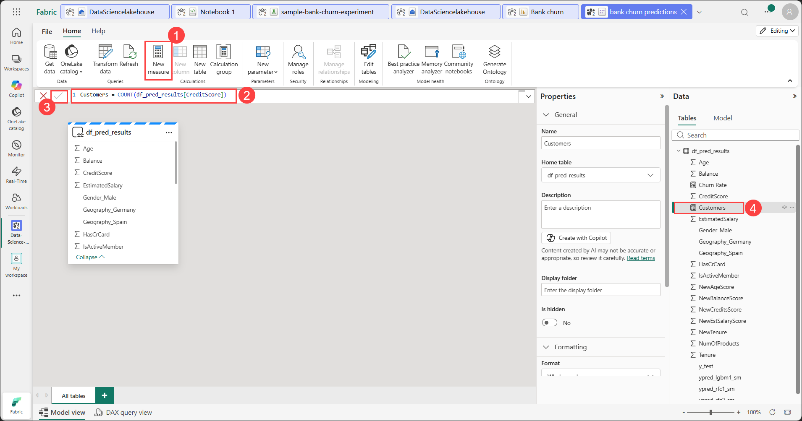

1. To add the churn rate for Germany. click **New measure (1)**, enter the following formula (**2)** in the formula bar, and click the **check mark (3)** to create the measure.

1. This filters the rows down to the ones with Germany as their geography (Geography_Germany equals one).

     ```
     Germany Churn = CALCULATE(
         [Churn Rate],
         df_pred_results[Geography_Germany] = 1
     ```

      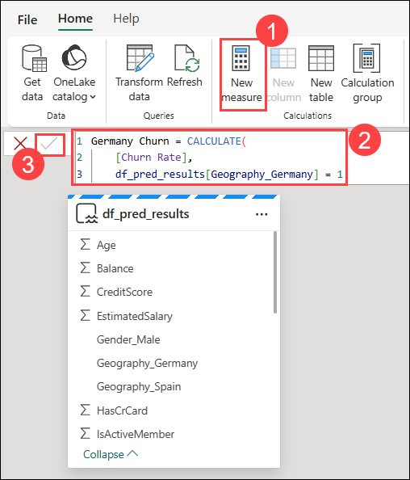

1. To add the churn rate for Spain. click **New measure (1)**, enter the following formula (**2)** in the formula bar, and click the **check mark (3)** to create the measure.

    ```
    Spain Churn = CALCULATE(
        [Churn Rate],
        df_pred_results[Geography_Spain] = 1
    )
    ```	

     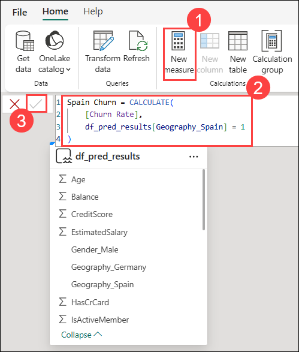

### Task 13: Create new report

1. From the top ribbon, select **File (1)** and select **Create new report (2)** to start creating reports/dashboards in Power BI.

    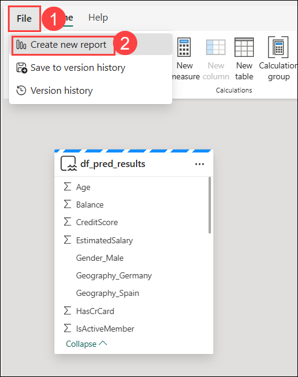

1. In the Ribbon, select **Text box (1)**., set the text size as **24** (**2)** and font as **Times New Roman** (**3)**, enter the title text **Bank Customer Churn (4)** in the text box, expand **Effects (5)**, turn on **Background (6)**, choose a color **(7)**.

    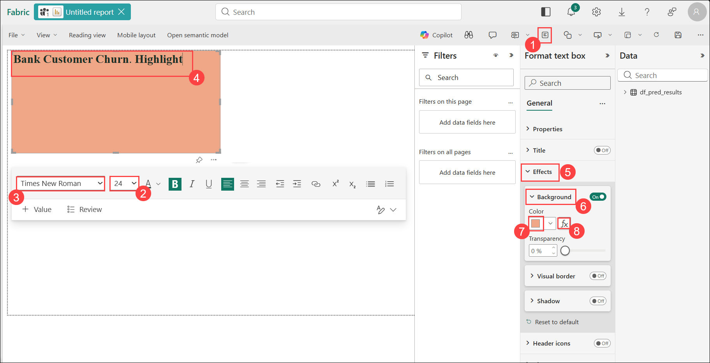

1. In the Visualizations panel, select the **Card (2)** icon. From
    the **Data** pane, select **Churn Rate (1)**. Change the font size and
    background color in the Format panel. Drag this visualization to the
    top right of the report **(3)**.

    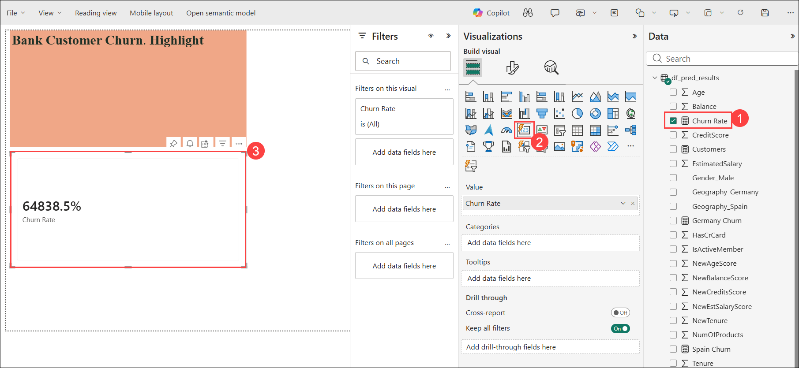

1. In the Visualizations panel, select the **Line and stacked column chart (1)** icon, add **Age (2)**, **Churn Rate (3)**, and **Customers (4)**, ensure they appear under the **Column y-axis (5)**, and place the chart on the canvas **(6)** to visualize the metrics.

      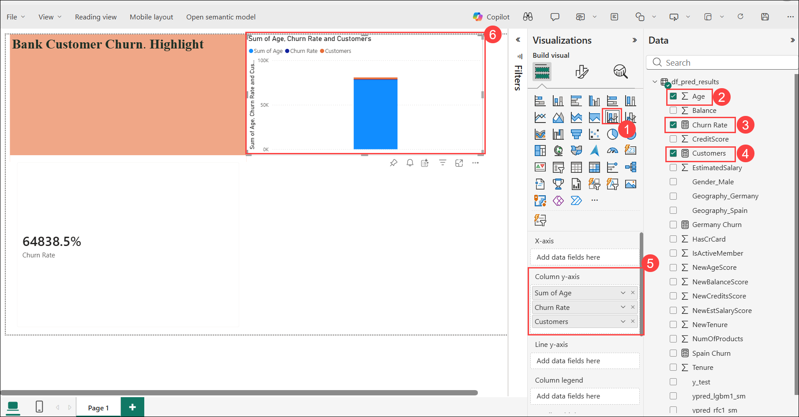

1. In the Visualizations panel, select the **Line and clustered column chart (1)**, then add **Age (2)** to the **X-axis (5)**, set **Churn Rate (3)** under the **Column y-axis (6)**, and place **Customers (4)** under the **Line y-axis (7)** to visualize churn trends by age **(8)**.

      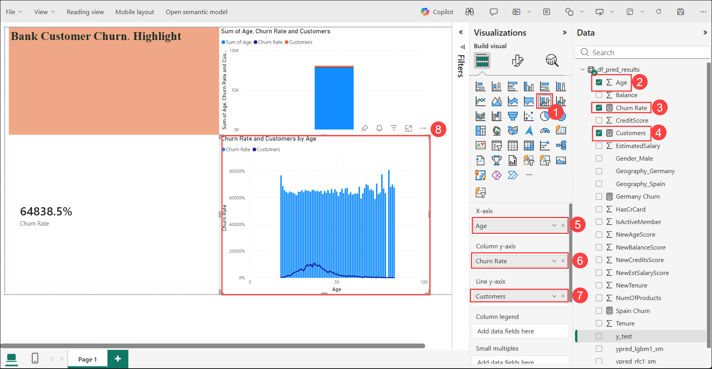

1. In the Visualizations panel, select the **Stacked columnchart (1)**, then add **Churn Rate (2)** to the **Y-axis** and **NewCreditScore (3)** to the **X-axis (4)** to visualize how churn varies across credit score segments **(5)**.

      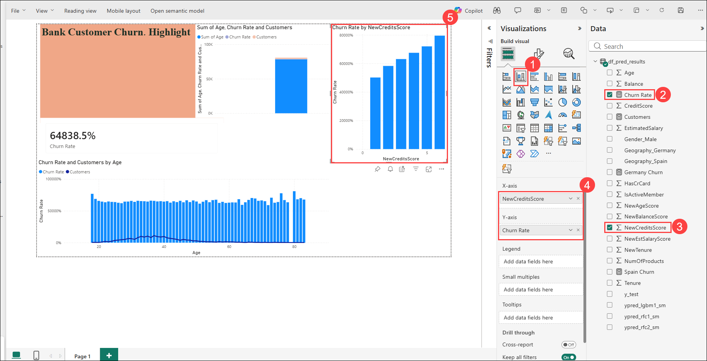

1. Go to the **Format your visuals (1)** pane, switch to the **Visual tab (2)**, expand **X-axis (3)**, then enable **Title (4)** and update the **Title text (5)** to **“Credit Score”**, which will reflect on the chart axis label **(6)**.

      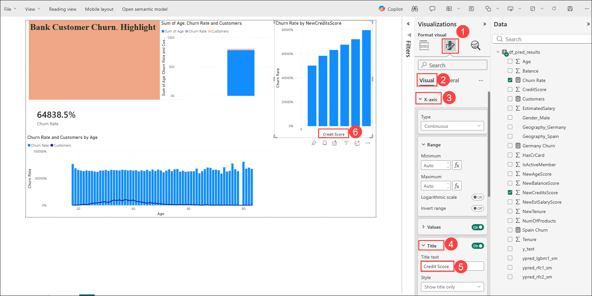

1. Click on **File (1)** in the top menu, then select **Save (2)** to save the report.

      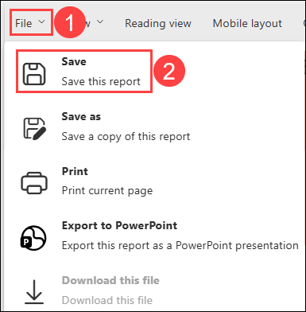

1. Enter the name of your report as **Bank churn Power BI report (1)**.
    Select **Save (2)**

      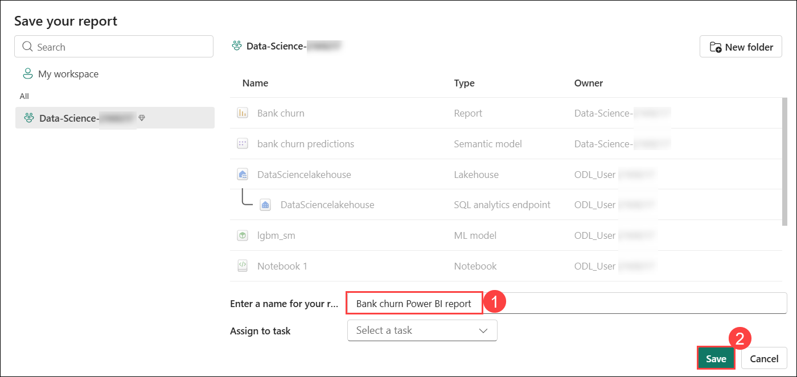

      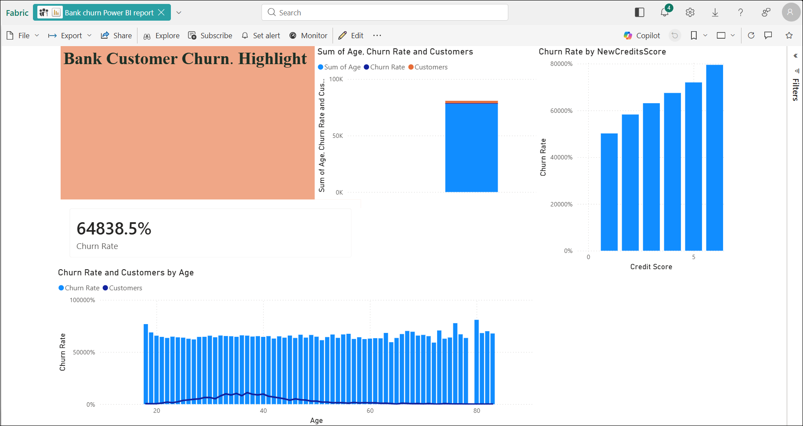

The Power BI report shows:

- Customers who use more than two of the bank products have a higher
  churn rate although few customers had more than two products. The bank
  should collect more data, but also investigate other features
  correlated with more products (see the plot in the bottom left panel).

- Bank customers in Germany have a higher churn rate than in France and
  Spain (see the plot in the bottom right panel), which suggests that an
  investigation into what has encouraged customers to leave could be
  beneficial.

- There are more middle aged customers (between 25-45) and customers
  between 45-60 tend to exit more.

- Finally, customers with lower credit scores would most likely leave
  the bank for other financial institutes. The bank should look into
  ways that encourage customers with lower credit scores and account
  balances to stay with the bank.

### Task 14: Clean up resources

You can delete individual reports, pipelines, warehouses, and other
items or remove the entire workspace. Use the following steps to delete
the workspace you created for this tutorial.

1. Click the **Data-Science workspace (1)** from the left navigation pane and select your workspace **Data-Science-** **(2)** to view all created items.

    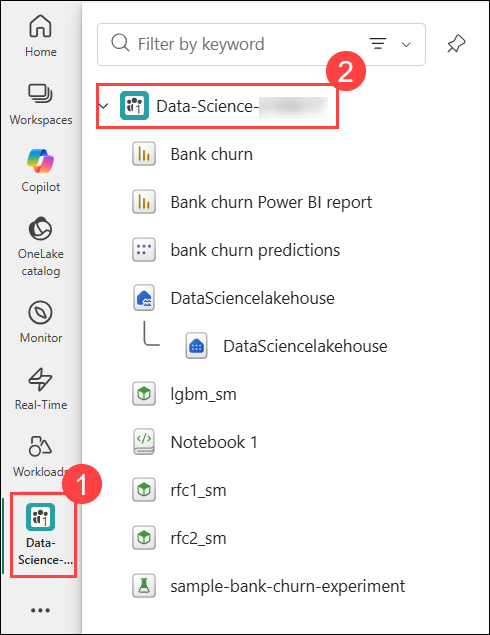

1. Click on **Workspace settings** in the top-right corner to open and manage workspace configurations.

      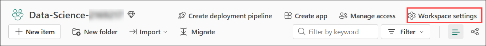

1. Select **General tab** and **Remove this workspace** to clean up the resources.

     

## Summary

In this use case, you successfully implemented an end-to-end data science solution using Microsoft Fabric. You explored and prepared a real-world bank churn dataset using notebooks and Data Wrangler, performed data cleaning and feature engineering, and transformed the data into a structured format for analysis. You then built and trained multiple machine learning models, tracked experiments using MLflow, and evaluated model performance using standard metrics and visualizations. Finally, you generated predictions at scale, stored the results in the Lakehouse, and created interactive Power BI reports to derive business insights, demonstrating a complete data science lifecycle from data ingestion to insight generation within Fabric. 


## You have successfully completed this lab!

